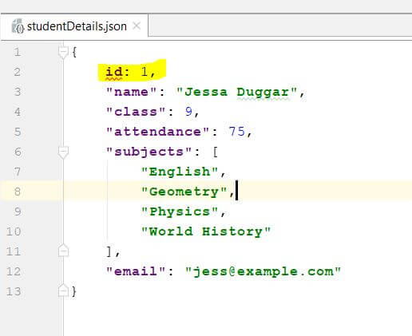
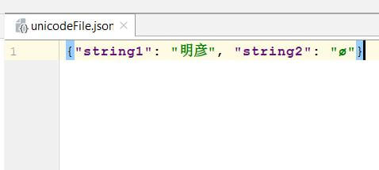

# Python JSON

In this tutorial, we'll see how we can create, manipulate, and parse JSON in Python using the standard a json module. The built-in Python json module provides us with methods and classes that are used to parse and manipulate JSON in Python.

**What is JSON**?

JSON (an acronym for JavaScript Object Notation) is a data-interchange format and is most commonly used for client-server communication. Refer Official JSON documentation.

**Example**:

```json
{"name": "jane doe", "salary": 9000, "email": "JaneDoe@pynative.com"}
```

A JSON is an unordered collection of key and value pairs, resembling Python's native dictionary.

- **Keys** are `unique strings` that cannot be null.
- **Values** can be anything from a `string`, `boolean`, `number`, `list`, or even
  `null`.
- A JSON can be represented by a `string` enclosed within curly braces with keys and
  values separated by a colon, and pairs separated by a comma

Whenever the client needs information, it calls the server using a URI, and the server returns data to the client in the form of JSON. Later we can use this data in our application as per our requirement. Also, when the client application wants to store the data on the server. It can POST that data in the form of JSON.

JSON is most commonly used for client-server communication because:

- It is human readable.
- It's both easy to read/write and
- JSON is language-independent.

**Python json Module**:

Python comes with a built-in module called `json` for working with JSON data. You only need to add import json at the start of your file and you are ready to use it.


## Python JSON dump() and dumps() for JSON Encoding

In this article, You will learn how to use the Python `json` module to write Python serialized objects as JSON formatted data into file and string. The `json` module provides the following two methods to encode Python objects into JSON format.

- The `json.dump()` method (without “s” in “dump”) used to write Python serialized object as JSON formatted data into a file.
- The `json.dumps()` method encodes any Python object into JSON formatted String.

The `json.dump()` and  `json.dumps()`  is used for following operations:

- Encode Python serialized objects as JSON formatted data.
- Encode and write Python objects into a JSON file
- PrettyPrinted JSON data
- Skip nonbasic types while JSON encoding
- Perform compact encoding to save file space
- Handle non-ASCII data while encoding JSON


### Syntax of json.dump() and json.dumps()

You can do many things using `json.dump()` and `json.dumps()` method. Let’s understand the different parameters of `json.dump()` to achieve different results.

**Syntax of json.dump()**:

```py
json.dump(obj, fp, *, skipkeys=False, ensure_ascii=True, check_circular=True,  
allow_nan=True, cls=None, indent=None, separators=None, default=None,  
sort_keys=False, **kw)
```

**Use**: It is used to write a Python object into a file as a JSON formatted data.

**Syntax of json.dumps()**:

```py
json.dumps(obj, *, skipkeys=False, ensure_ascii=True, check_circular=True,  
allow_nan=True, cls=None, indent=None, separators=None, default=None,  
sort_keys=False, **kw)
```

**Use**: It is used to write a Python object into a JSON String.

**Parameters used**:

- **obj** is nothing but a Python serializable object which you want to convert
  into a JSON format.
- A **fp** is a file pointer used to write JSON formatted data into file. Python
  json module always produces string objects, not bytes objects, therefore, fp.write() must support string input.
- If **skipkeys** is true (default: False), then dict keys that are not of a basic
  type, (str, int, float, bool, None) will be skipped instead of raising a TypeError. For example, if one of your dictionary keys is a custom Python object, that key will be omitted while converting the dictionary into JSON.
- If **ensure_ascii** is true (the default), the output is guaranteed to have all
  incoming non-ASCII characters escaped. If **ensure_ascii** is false, these characters will be output as-is.
- **allow_nan** is True by default so their JavaScript equivalents (NaN, Infinity,
  -Infinity) will be used. If False it will be a ValueError to serialize out of range float values (nan, inf, -inf).
- An **indent** argument is used to pretty-print JSON to make it more readable. The
  default is (', ', ': ') . To get the most compact JSON representation, you should use (',', ':')  to eliminate whitespace.
- If **sort_keys** is true (default: False), then the output of dictionaries will be sorted by key.

### `json.dumps()` to convert Python primitive types into JSON equivalent

There are multiple scenarios where you need to use serialized JSON data in your program. If you need this serialized JSON data in your application of further processing then you can convert it to a native Python str object instead of writing it in a file.

For example, you receive an HTTP request to send developer detail. You fetched developer data from the database table and store it in a Python dictionary or any Python object, Now you need to send that data back to the requested application so you need to convert the Python dictionary object into a JSON formatted string to send as a response in JSON string. To do this you need to use `json.dumps()`.

The `json.dumps()` returns the JSON string representation of the Python dict. Let see the example now.

**Example**: Convert Python dictionary into a JSON formatted String

```py
import json

def SendJsonResponse(resultDict):
    print("Convert Python dictionary into JSON formatted string")
    developer_str = json.dumps(resultDict)
    print(developer_str)

# sample developer dict
developer_Dict = {
    "name": "Jane Doe",
    "salary": 9000,
    "skills": ["Python", "Machine Learning", "Web Development"],
    "email": "jane.doe@pynative.com"
}

SendJsonResponse(developer_Dict)
```

**Output**:

```json
Convert Python dictionary into JSON formatted string
{"name": "Jane Doe", "salary": 9000, "skills": ["Python", "Machine Learning",  
"Web Development"], "email": "jane.doe@pynative.com"}
```

### Mapping between JSON and Python entities while Encoding

To encode Python objects into JSON equivalent `json` module uses the following conversion table. The `json.dump()` and `json.dumps()` the method performs the translations when encoding.

Now let’s see how to convert all Python primitive types such as a `dict`, `list`, `set`, `tuple`, `str`, `numbers` into JSON formatted data. Please refer to the following table to know the mapping between JSON and Python data types.

**Python JSON**:

 Python | JSON
------ | --------------------------------------
 dict | object
 list, tuple | array
 str | string
 int, float, int & float-derived Enums | number
 True | true
 False | false
 None | null

Let see the example now.

```py
import json

sampleDict = {
    "colorList": ["Red", "Green", "Blue"],
    "carTuple": ("BMW", "Audi", "range rover"),
    "sampleString": "pynative.com",
    "sampleInteger": 457,
    "sampleFloat": 225.48,
    "booleantrue": True,
    "booleanfalse": False,
    "nonevalue": None
}

print("Converting Python primitive types into JSON")
resultJSON = json.dumps(sampleDict)
print("Done converting Python primitive types into JSON")
print(resultJSON)
```

Output:

```json
Converting Python primitive types into JSON
Done converting Python primitive types into JSON

{
    "colorList": ["Red", "Green", "Blue"], 
    "carTuple": ["BMW", "Audi", "rangerover"],  
    "sampleString": "pynative.com", 
    "sampleInteger": 457, 
    "sampleFloat": 225.48,  
    "booleantrue": true, 
    "booleanfalse": false, 
    "nonevalue": null
}
```

### `json.dump()` to encode and write JSON data to a file

We can use it in the following cases:

- To write the JSON response in a file: Most of the time, when you execute a GET
  request, you receive a response in JSON format, and you can store JSON response in a file for future use or for an underlying system to use.
- For example, you have data in a list or dictionary or any Python object, and you
  want to encode and store it in a file in the form of JSON.

In this example, we are going to convert the Python dictionary into a JSON format and write it into a file.

```py
import json

# assume you have the following dictionary
developer = {
    "name": "jane doe",
    "salary": 9000,
    "email": "JaneDoe@pynative.com"
}

print("Started writing JSON data into a file")
with open("developer.json", "w") as write_file:
    json.dump(developer, write_file) # encode dict into JSON
print("Done writing JSON data into .json file")
```

**Output**:

```json
Started writing JSON data into a file
Done writing JSON data into developerDetail.json file
```


### Write Indented and pretty printed JSON data into a file

If the user wants to read a JSON file so it must be readable and well organized, so whoever consumes this will have a better understanding of a structure of a data. The dump() method provides the following arguments to `pretty-print` JSON data.
  
- The `indent` parameter specifies the spaces that are used at the beginning of a
    line.
- The `separator` argument of a `json.dump` method you can specify any separator
    between key and value.
- The `sort_keys` to sort JSON data by keys.

Let’s see how to write `pretty-printed` JSON data into a file.

```py
import json

developer = {
    "name": "jane doe",
    "salary": 9000,
    "skills": ["Raspberry pi", "Machine Learning", "Web Development"],
    "email": "JaneDoe@pynative.com"
}

with open("developerPrettyPrint.json", "w") as write_file:
    json.dump(developer, write_file, indent=4, separators=(", ", ": "), sort_keys=True)
print("Done writing pretty printed JSON data into a file")
```

**Output**:

```json
Done writing pretty printed JSON data into a file
```


### Compact encoding to save file space by changing JSON key-value separator

If you are will not reading a file, but you only need to write JSON data into a file to use by the underlying system or application, then you can write JSON data into a file by doing compact encoding.

We can write JSON data into a file by changing the JSON key-value separator. You can change JSON representation as per your needs. Using the separator argument of a `json.dump()` method you can specify any separator between key and value.

To limit the JSON file size we can remove extra spacing between JSON key-value. I have decided to do the compact encoding (`separators=(',', ':')`). Using this separator we can remove the whitespaces from JSON to make the JSON more compact and save bytes from being sent via HTTP. Now, Let see the example.

```py
import json

developer_dict = {
    "name": "jane doe",
    "salary": 9000,
    "skills": ["Raspberry pi", "Machine Learning", "Web Development"],
    "companies": ["Google", "Facebook", "IBM"],
    "email": "JaneDoe@pynative.com"
}

print("Started writing compact JSON data into a file")
with open("developerDetailCompact.json", "w") as write_file:
    json.dump(developer_dict, write_file, separators=(',', ':'))
print("Done writing compact JSON data into json file")
```

**Output**:

```json
Started writing compact JSON data into a file
Done writing compact JSON data into .json file
```

File content:

```json
{"name":"jane doe","salary":9000,"skills":["Raspberry pi","Machine Learning",  
"Web Development"],"companies":["Google","Facebook","IBM"],  
"email":"JaneDoe@pynative.com"}
```

### Skip nonbasic types while writing JSON into a file using `skipkeys` parameter

The built-in json module of Python can only handle Python primitives types that have a direct JSON equivalent (e.g., `dictionary`, `lists`, `strings`, `ints`, `None`, etc.).

If the Python dictionary contains a custom Python object as one of the keys and if we try to convert it into a JSON format, you will get a `TypeError` i.e., `Object of type "Your Class" is not JSON serializable`.

If this custom object isn’t required in JSON data, you can skip it using a `skipkeys=true` argument of the `json.dump()` method.

If `skipkeys` is True, then dict keys that are not of a basic type (str, int, float, bool, None) will be skipped instead of raising a `TypeError`.

If it is necessary to convert it into JSON, then you can refer to our article on how to `Make Python class JSON Serializable`.

Now, Let’s see the example.

```py
import json

class PersonalInfo:
    def __init__(self, name, age):
        self.name = name
        self.age = age

    def showInfo(self):
        print("Developer name is " + self.name, "Age is ", self.age)

dev = PersonalInfo("John", 36)

developer_Dict = {
    PersonalInfo: dev,
    "salary": 9000,
    "skills": ["Python", "Machine Learning", "Web Development"],
    "email": "jane.doe@pynative.com"
}

print("Writing JSON data into file by skipping non-basic types")
with open("developer.json", "w") as write_file:
    json.dump(developer_Dict, write_file, skipkeys=True)
print("Done")
```

**Output**:

```json
Writing JSON data into file by skipping non-basic types
Done
```
  


As you can see in the JSON output the `PersonalInfo` object is skipped.

### Handle non-ASCII characters from JSON data while writing it into a file

The `json.dump()` method has `ensure_ascii` parameter. The `ensure_ascii` is by-default true. The output is guaranteed to have all incoming non-ASCII characters escaped. If `ensure_ascii` is false, these characters will be output as-is. If you want to store non-ASCII characters, as-is use the following code.

```py
import json

unicode_string = u"\u00f8"
print("unicode String is ", unicode_string)

# set ensure_ascii=False
print("JSON character encoding by setting ensure_ascii=False")
print(json.dumps(unicode_string, ensure_ascii=False))
```

**Output**:  
unicode String is `ø`  
JSON character encoding by setting `ensure_ascii=False` -> `ø`

## Python JSON Parsing using json.load() and loads()

This article demonstrates how to use Python’s `json.load()` and `json.loads()` methods to read JSON data from file and String. Using the `json.load()` and `json.loads()` method, you can turn JSON encoded/formatted data into Python types. This process is known as JSON decoding. Python built-in module `json` provides the following two methods to decode JSON data.

To parse JSON from URL or file, use `json.load()`. For parse string with JSON content, use `json.loads()`.


### Syntax of the json.load() and json.loads()

We can do many JSON parsing operations using the load and loads() method. First, understand it’s syntax and arguments, then we move to its usage one-by-one.

**Synatx of `json.load()`**:

```py
json.load(fp, *, cls=None, object_hook=None, parse_float=None, parse_int=None,  
parse_constant=None, object_pairs_hook=None, **kw)
```

**Syntax of `json.loads()`**:

```py
json.loads(s, *, cls=None, object_hook=None, parse_float=None, parse_int=None,  
parse_constant=None, object_pairs_hook=None, **kw)
```

All arguments have the same meaning in both methods.

**Parameter used**:

The `json.load()` is used to read the JSON document from file and the `json.loads()` is used to convert the JSON String document into the Python dictionary.

- **fp** file pointer used to read a text file, binary file or a JSON file that contains a JSON
  document.
- **object_hook**  is the optional function that will be called with the result of any object
  literal decoded. The Python built-in json module can only handle primitives types that have a direct JSON equivalent (e.g., dictionary, lists, strings, Numbers, None, etc.). But when you want to convert JSON data into a custom Python type, we need to implement custom decoder and pass it as an object `object_hook` to a `load()` method so we can get a custom Python type in return instead of a dictionary.
- **object_pairs_hook** is an optional function that will be called with the result of any object
  literal decoded with an ordered list of pairs. The return value of `object_pairs_hook` will be used instead of the Python dictionary. This feature can also be used to implement custom decoders. If `object_hook` is also defined, the `object_pairs_hook` takes priority.
- **parse_float** is optional parameters but, if specified, will be called with the string of
  every JSON float and integer to be decoded. By default, this is equivalent to float(num_str).
- **parse_int** if specified, it will be called with the string of every JSON int to be decoded.
  By default, this is equivalent to int(num_str).

We will see the use of all these parameters in detail.

### `json.load()` to read JSON data from a file and convert it into a dictionary

Using a `json.load()` method, we can read JSON data from text, JSON, or binary file. The `json.load()` method returns data in the form of a Python dictionary. Later we use this dictionary to access and manipulate data in our application or system.

### Mapping between JSON and Python entities while decoding

Please refer to the following conversion table, which is used by the json.load() and json.loads() method for the translations in decoding.

JSON | Python
----- | ------------
object | dict
array | list
string | str
number (int) | int
number (real) | float
true | True
false | False
null | None

Now, let’s see the example. For this example, I am reading the `“developer.json”` file present on my hard drive. This file contains the following JSON data.

```json
{
    "name": "jane doe",
    "salary": 9000,
    "skills": [
        "Raspberry pi",
        "Machine Learning",
        "Web Development"
    ],
    "email": "JaneDoe@pynative.com",
    "projects": [
        "Python Data Mining",
        "Python Data Science"
    ]
}
```


Example

```py
import json

print("Started Reading JSON file")
with open("developer.json", "r") as read_file:
    print("Converting JSON encoded data into Python dictionary")
    developer = json.load(read_file)

    print("Decoded JSON Data From File")
    for key, value in developer.items():
        print(key, ":", value)
    print("Done reading json file")
```

**Output**:

```json
Started Reading JSON file
Converting JSON encoded data into Python dictionary

Decoded JSON Data From File
name : jane doe
salary : 9000
skills : ['Raspberry pi', 'Machine Learning', 'Web Development']
email : JaneDoe@pynative.com
projects : ['Python Data Mining', 'Python Data Science']

Done reading json file
```

### Access JSON data directly using key name

Use the following code If you want to access the JSON key directly instead of iterating the entire JSON from a file.

```py
import json

print("Started Reading JSON file")
with open("developer.json", "r") as read_file:
    print("Converting JSON encoded data into Python dictionary")
    developer = json.load(read_file)

    print("Decoding JSON Data From File")
    print("Printing JSON values using key")
    print(developer["name"])
    print(developer["salary"])
    print(developer["skills"])
    print(developer["email"])
    print("Done reading json file")
```

**Output**:

```json
Started Reading JSON file
Converting JSON encoded data into Python dictionary

Decoding JSON Data From File
Printing JSON values using key

jane doe
9000
['Raspberry pi', 'Machine Learning', 'Web Development']
JaneDoe@pynative.com

Done reading json file
```

You can read the JSON data from text, json, or a binary file using the same way mentioned above.

### json.loads() to convert JSON string to a dictionary

Sometimes we receive JSON response in string format. So to use it in our application, we need to convert JSON string into a Python dictionary. Using the `json.loads()` method, we can deserialize native String, byte, or bytearray instance containing a JSON document to a Python dictionary. We can refer to the conversion table mentioned at the start of an article.

```py
import json

developerJsonString = """{
    "name": "jane doe",
    "salary": 9000,
    "skills": [
        "Raspberry pi",
        "Machine Learning",
        "Web Development"
    ],
    "email": "JaneDoe@pynative.com",
    "projects": [
        "Python Data Mining",
        "Python Data Science"
    ]
}
"""

print("Started converting JSON string document to Python dictionary")
developerDict = json.loads(developerJsonString)

print("Printing key and value")
print(developerDict["name"])
print(developerDict["salary"])
print(developerDict["skills"])
print(developerDict["email"])
print(developerDict["projects"])

print("Done converting JSON string document to a dictionary")
```

**Output**:

```json
Started converting JSON string document to Python dictionary

Printing key and value
jane doe
9000
['Raspberry pi', 'Machine Learning', 'Web Development']
JaneDoe@pynative.com
['Python Data Mining', 'Python Data Science']

Done converting JSON string document to a dictionary
```

### Parse and Retrieve nested JSON array key-values

Let’s assume that you’ve got a JSON response that looks like this:

```py
developerInfo = """{
    "id": 23,
    "name": "jane doe",
    "salary": 9000,
    "email": "JaneDoe@pynative.com",
    "experience": {"python":5, "data Science":2},
    "projectinfo": [{"id":100, "name":"Data Mining"}]
}
"""
```

For example, You want to retrieve the project name from the developer info JSON array to get to know on which project he/she is working. Let’s see now how to read nested JSON array key-values.

In this example, we are using a developer info JSON array, which has project info and experience as nested JSON data.

```py
import json

print("Started reading nested JSON array")
developerDict = json.loads(developerInfo)

print("Project name: ", developerDict["projectinfo"][0]["name"])
print("Experience: ", developerDict["experience"]["python"])

print("Done reading nested JSON Array")
```

**Output**:

```json
Started reading nested JSON array
Project name:  Data Mining
Experience:  5
Done reading nested JSON Array
```

### Load JSON into an OrderedDict

`OrderedDict` can be used as an input to JSON. I mean, when you dump JSON into a file or string, we can pass `OrderedDict` to it.

But, when we want to maintain order, we load JSON data back to an OrderedDict so we can keep the order of the keys in the file.

As we already discussed in the article, a  `object_pairs_hook` parameter of a `json.load()` method is an optional function that will be called with the result of any object literal decoded with an ordered list of pairs.

Let’ see the example now.

```py
import json
from collections import OrderedDict

print("Ordering keys")
OrderedData = json.loads('{"John":1, "Emma": 2, "Ault": 3, "Brian": 4}', 
    object_pairs_hook=OrderedDict)
print("Type: ", type((OrderedData)))
print(OrderedData)
```

**Output**:

```shell
Ordering keys
Type:  <class 'collections.OrderedDict'>
OrderedDict([('John', 1), ('Emma', 2), ('Ault', 3), ('Brian', 4)])
```

### How to use parse_float and parse_int kwarg of json.load()

As I already told `parse_float` and `parse_int`, both are optional parameters but, if specified, will be called with the string of every JSON float and integer to be decoded. By default, this is equivalent to `float(num_str)` and `int(num_str)`.

Suppose the JSON document contains many `float` values, and you want to round all float values to two decimal-point. In this case, we need to define a custom function that performs whatever rounding you desire. We can pass such a function to `parse_float` kwarg.

Also, if you wanted to perform any operation on integer values, we could write a custom function and pass it to `parse_int` kwarg. For example, you received leave days in the JSON document, and you want to calculate the salary to deduct.

**Example**:

```py
import json

def roundFloats(salary):
    return round(float(salary), 2)

def salartToDeduct(leaveDays):
    salaryPerDay = 465
    return int(leaveDays) * salaryPerDay

print("Load float and int values from JSON and manipulate it")
print("Started Reading JSON file")
with open("developerDetails.json", "r") as read_file:
    developer = json.load(read_file, parse_float=roundFloats,
                          parse_int=salartToDeduct)
    # after parse_float
    print("Salary: ", developer["salary"])

    # after parse_int
    print("Salary to deduct: ", developer["leavedays"])
    print("Done reading a JSON file")
```

**Output**:

```sh
Load float and int values from JSON and manipulate it
Started Reading JSON file
Salary:  9250.542
<class 'float'>
Salary to deduct:  3
Done reading a JSON file
```

### Implement a custom JSON decoder using json.load()

The built-in json module of Python can only handle Python primitives types that have a direct JSON equivalent (e.g., dictionary, lists, strings, numbers, None, etc.).

When you execute a `json.load` or `json.loads()` method, it returns a Python dictionary. If you want to convert JSON into a custom Python object then we can write a custom JSON decoder and pass it to the `json.loads()` method so we can get a custom Class object instead of a dictionary.

Let’s see how to use the JSON decoder in the load method. In this example, we will see how to use `object_hook`  parameter of a load method.

```py
import json
from collections import namedtuple
from json import JSONEncoder

def movieJsonDecod(movieDict):
    return namedtuple('X', movieDict.keys())(*movieDict.values())

# class for your reference
class Movie:
    def __init__(self, name, year, income):
        self.name = name
        self.year = year
        self.income = income

# Suppose you have this json document.
movieJson = """{
    "name": "Interstellar",
    "year": 2014,
    "income": 7000000
}"""

# Parse JSON into an Movie object
movieObj = json.loads(movieJson, object_hook=movieJsonDecod)
print("After Converting JSON into Movie Object")
print(movieObj.name, movieObj.year, movieObj.income)
```

**Output**:

```sh
After Converting JSON into Movie Object
Interstellar 2014 7000000
```

## Validate JSON data using Python

In this article, we will see how to validate JSON data using Python. There are multiple scenarios where we need different types of JSON validation. In this article, we will cover the followings

- **Check if a string is valid JSON in Python**: Here we can check if a string is valid JSON before
  parsing it. For example, if you are working with any API, what if it returns Invalid JSON or any other data? Here, we will validate JSON as per the standard convention format.
- **Validate JSON Schema using Python**: Here we will see how to validates incoming JSON data by
  checking if there all necessary fields present in JSON and also validate data types of those fields.


### Check if a string is valid JSON in Python

When we receive the JSON response from any API, we must validate it before performing any operation using that data. There are various ways to validate JSON as per the standard convention format.

**Using json.loads and json.load() method**:

As we know, the json module provides two methods to parse JSON data using Python.

- **json.loads()**: To parse JSON from String.
- **json.load()**: To Parse JSON from a file.

Both methods will throw a `ValueError` if the string or data you pass can’t be decoded as JSON. When we receive a JSON response, we can pass it to the `json.loads()` method to validate it as per the standard convention. Let’s see the example.

```py
import json

def validateJSON(jsonData):
    try:
        json.loads(jsonData)
    except ValueError as err:
        return False
    return True

InvalidJsonData = """{"name": "jane doe", "salary": 9000, "email": "jane.doe@pynative.com",}"""
isValid = validateJSON(InvalidJsonData)

print("Given JSON string is Valid", isValid)

validJsonData = """{"name": "jane doe", "salary": 9000, "email": "jane.doe@pynative.com"}"""
isValid = validateJSON(validJsonData)

print("Given JSON string is Valid", isValid)
```

**Output**:

```sh
Given JSON string is Valid False
Given JSON string is Valid True
```

- As you can see in the first example, we passed an invalid JSON string to the load method. In the
  first JSON data, we have added an extra comma to make it invalid because of this `json.loads` method generated a valueError.
- In the second call, we passed a valid JSON document, and it successfully parsed by the `json.
  loads` method.

**Note**:  
Use `json.load()` method instead of `json.loads()` to parse and validate JSON from a file.

### Validate JSON Object from the command line before writing it in a file

Python provides The `json.tool` module to validate JSON objects from the command line. When we send JSON response to a client or when we write JSON data to file we need to make sure that we write validated data into a file.

Run a below command on the command line. Here we are validating the Python dictionary in a JSON formatted string.

```sh
echo {"id": 1, "item": "itemXyz"} | python -m json.tool
```

**Output**:

```json
{
    "id": 1,
    "name": "itemXyz"
}
```

Let’s pass an invalid object for JSON validating.

```sh
echo {"id": 1 "name": "Jessa Duggar"} | python -m json.tool
```

**Output**:

```json
Expecting ',' delimiter: line 1 column 10 (char 9)
```

We can also use different command-line options of `json.tool` module to validate JSON. Let’s see those.

### Validate JSON File

Let’s assume that you want to parse a JSON file using Python. Instead of directly parsing it, we need to validate it so that we can assure that file content is a valid JSON document. Let’s see how to use a command-line option of a `json.tool` module to validate file containing JSON data.

File content before running the following command:



Command:

```sh
python -m json.tool fileName
```

Example:

```sh
python -m json.tool studentDetails.json
```

We received the following error because the file content is not in JSON format.

```json
error expecting property name enclosed in double quotes: line 1 column 2 (char 1)
```

Executed the same command after correcting an error:

**Output**:

```json
{
    "id": 1,
    "name": "Jessa Duggar",
    "class": 9,
    "attendance": 75,
    "subjects": [
        "English",
        "Geometry",
        "Physics",
        "World History"
    ],
    "email": "jess@example.com"
}
```

### Validate JSON Schema using Python

Sometimes we need something extra than just a standard JSON validation. i.e., We will see how to validate incoming JSON data by checking all necessary fields present in JSON file or response and also validate data types of those fields.

Such a scenario includes the following things:

- We need the necessary fields present in JSON file
- We need data of a JSON filed in a type that we want.  
  
For example, we want all numeric fields in the number format instead of number encoded in a string format like this `"Marks": "75"` so we can use it directly instead of checking and converting it every time.

We need to use the `jsonschema` library. This library is useful for validating JSON data. The library uses the format to make validations based on the given schema. `jsonschema` is an implementation of JSON Schema for Python.

Using `jsonschema`, we can create a schema of our choice, so every time we can validate the JSON document against this schema, if it passed, we could say that the JSON document is valid.

Follow the below steps:

- **Install `jsonschema`**: using `pip` command, `pip install jsonschema`.
- **Define schema**: Describe what kind of JSON you expect
- **Convert JSON to Python Object**: using `json.load` or `json.loads` methods.
- **Pass resultant JSON to validate() method of a jsonschema**: This method will raise an
  exception if given json is not what is described in the schema.

Let’s see the example. In this example, I am validating student JSON. The following conditions must meet to call it as a valid JSON:

- The student name and roll number must be present in JSON data.
- Marks and roll number must be in a number format.

```py
import json
import jsonschema
from jsonschema import validate

# Describe what kind of json you expect.
studentSchema = {
    "type": "object",
    "properties": {
        "name": {"type": "string"},
        "rollnumber": {"type": "number"},
        "marks": {"type": "number"},
    },
}

def validateJson(jsonData):
    try:
        validate(instance=jsonData, schema=studentSchema)
    except jsonschema.exceptions.ValidationError as err:
        return False
    return True

# Convert json to python object.
jsonData = json.loads('{"name": "jane doe", "rollnumber": "25", "marks": 72}')

# validate it
isValid = validateJson(jsonData)
if isValid:
    print(jsonData)
    print("Given JSON data is Valid")
else:
    print(jsonData)
    print("Given JSON data is InValid")

# Convert json to python object.
jsonData = json.loads('{"name": "jane doe", "rollnumber": 25, "marks": 72}')
# validate it
isValid = validateJson(jsonData)
if isValid:
    print(jsonData)
    print("Given JSON data is Valid")
else:
    print(jsonData)
    print("Given JSON data is InValid")
```

**Output**:

```json
{'name': 'jane doe', 'rollnumber': '25', 'marks': 72}
Given JSON data is InValid
{'name': 'jane doe', 'rollnumber': 25, 'marks': 72}
Given JSON data is Valid
```

**Note**: The `validate()` method will raise an exception if given JSON is not what is described in the schema.

The first JSON data contains roll number value in string format instead of a number so when we called `validate()` method it returned False. If print exception it will show like this.

```json
Failed validating 'type' in schema['properties']['rollnumber']:
    {'type': 'number'}

On instance['rollnumber']:
    '25'
```

## Python PrettyPrint JSON Data

`PrettyPrint` is useful to display JSON in an easy-to-read (for human readers) format. When we say PrettyPrinting JSON in Python, we consider primarily for indentation, key-value separators, and whitespace.

Scenarios where we need JSON PrettyPrinting In Python:

- Write PrettyPrinted JSON formatted data into a file
- Prettyprint JSON file: Let’s say you have a JSON file that is huge and not correctly indented,
  and you want to prettyprint it.
- Prettyprint JSON formatted string


### Write Indented and Pretty-printed JSON data into a file

In real-world cases, we deal with extensive JSON data. When we write JSON data into a file, we must make sure that the JSON data is readable and well organized, so whosever consuming it have a better understanding of the structure of JSON.

Using the `json.dump()` method of Python json module, we can write prettyprinted JSON into the file. The `json.dump()` method provides the following parameters to pretty-print JSON data.

- The `indent` parameter specifies the spaces that are used at the beginning of a line. We can use
  the `indent` parameter of `json.dump()` to specify the indentation value. By default, when you write JSON data into a file, Python doesn’t use indentations and writes all data on a single line, which is not readable.

- The `separator` parameter:  You can specify any separator between JSON key and value. The
  default separator is `(', ', ': ')`. For example, if you specify separators such as `(', ', ' : ')`, JSON will look like this.

  ```json
  {
      "key1" : "value2",
      "key2" : "value2"
  }
  ```

- The `sort_keys` parameter to sort JSON keys alphabetically.

Now, Let see the example.

```py
import json

print("Writing Indented and Pretty-printed JSON formatted data into a file")

student = {
    "id": 1,
    "name": "Jessa Duggar",
    "class": 9,
    "attendance": 75,
    "subjects": ["English", "Geometry"],
    "email": "jessa@pynative.com"
}

with open("studentWithoutPrettyPrint.json", "w") as write_file:
    json.dump(student, write_file)
print("Done writing JSON data into file without Pretty Printing it")

with open("studentWithPrettyPrint1.json", "w") as write_file:
    json.dump(student, write_file, indent=4)
print("Done writing PrettyPrinted JSON data into file with indent=4")

with open("studentWithPrettyPrint2.json", "w") as write_file:
    json.dump(student, write_file, indent=0)
print("Done writing PrettyPrinted JSON data into file with indent=0")

with open("studentWithPrettyPrint3.json", "w") as write_file:
    json.dump(student, write_file, indent=4, sort_keys=True)
print("Done writing Sorted and PrettyPrinted JSON data into file")
```

**Output**:

```json
Writing Indented and Pretty-printed JSON formatted data into a file

- JSON file without Pretty Printing it

  {"id": 1, "name": "Jessa Duggar", "class": 9, "attendance": 75,  
  "subjects": ["English", "Geometry"], "email": "jessa@pynative.com"}
  
  Done writing JSON data into file without Pretty Printing it

- Pretty-Printed JSON data into a file with indent=4

  {
      "id": 1,
      "name": "Jessa Duggar",
      "class": 9,
      "attendance": 75,
      "subjects": [
          "English",
          "Geometry"
      ],
      "email": "jessa@pynative.com"
  }
  
  Done writing PrettyPrinted JSON data into file with indent=4

- Pretty-Printed JSON data into a file with indent=0

  {
  "id": 1,
  "name": "Jessa Duggar",
  "class": 9,
  "attendance": 75,
  "subjects": [
  "English",
  "Geometry"
  ],
  "email": "jessa@pynative.com"
  }
  
  Done writing PrettyPrinted JSON data into file with indent=0

- After writing Pretty-Printed JSON data into a file with indent=4 and sorting keys.

  {
      "attendance": 75,
      "class": 9,
      "email": "jessa@pynative.com",
      "id": 1,
      "name": "Jessa Duggar",
      "subjects": [
          "English",
          "Geometry"
      ]
  }

Done writing Sorted and PrettyPrinted JSON data into file
```

**Remember**:  
If indent is a non-negative integer or string, then JSON array elements and object members will be pretty-printed with that indent level. For example, when we specify `indent=4`, Python uses four spaces for indentation.

An `indent=0`, negative, or "" will only insert newlines. `None` (the default) selects the most compact representation. Using a positive integer indent indents that many spaces per level. If indent is a string (such as `\t`), that string is used to indent each level.

### Read and PrettyPrint JSON file from Python

Let’s assume you have a large JSON file not correctly indented, and you want to prettyprint it. You can display prettyprinted JSON in Python using two ways. Let see each one by one.
We are using the `“student.json”` file stored on my computer for this example. This file contains the following data.

```json
{"id": 1, "name": "Jessa Duggar", "class": 9, "attendance": 75, 
"subjects": ["English", "Geometry", "Physics", "World History"], "email": "jess@example.com"}
```

We need to follow the below steps:

- Read the JSON file first using `json.load()` method.
- Use `json.dumps()` method to prettyprint JSON properly by specifying indent and separators. The
  `json.dumps()` method returns prettyprinted JSON data in string format.
- Print final JSON

Let’s see the example now.

```py
import json

with open("student.json", "r") as read_file:
    print("Read JSON file")
    student = json.load(read_file)

    print("Before Pretty Printing JSON Data")
    print(student)

    print("\n")

    PrettyJson = json.dumps(student, indent=4, separators=(',', ': '), sort_keys=True)
    print("Displaying Pretty Printed JSON Data")
    print(PrettyJson)
```

**Output**:

```json

Read JSON file

Before Pretty Printing JSON Data
{'id': 1, 'name': 'Jessa Duggar', 'class': 9, 'attendance': 75, 
'subjects': ['English', 'Geometry', 'Physics', 'World History'], 'email': 'jess@example.com'}

Displaying Pretty Printed JSON Data
{
    "attendance": 75,
    "class": 9,
    "email": "jess@example.com",
    "id": 1,
    "name": "Jessa Duggar",
    "subjects": [
        "English",
        "Geometry",
        "Physics",
        "World History"
    ]
}
```

### Use pprint module to pretty-print JSON

The `pprint` module provides the capability to “pretty-print” any Python data structures. Now, let’s see how to use the `pprint` module to pretty-print JSON data.

The `pprint.pprint()` function print the formatted representation of a JSON on the configured stream, followed by a newline

- Construct a PrettyPrinter instance first by configuring indent and width values. Also, set
  compact=False.
- Read the JSON file using json.load() method.
- Pass JSON data to pprint.pprint() function

Now, Let’s see the demo.

```PY
import json
import pprint

with open("studentWithoutPrettyPrint.json", "r") as read_file:
    print("Read JSON file")
    student = json.load(read_file)

    print("Before Pretty Printing JSON Data")
    print(student)

    print("\n")

# construct PrettyPrinter first
pp = pprint.PrettyPrinter(indent=4, width=80, compact=False)

print("Pretty Printing JSON Data using pprint module")
pp.pprint(student)
```

**Output**:

```JSON
Read JSON file

Before Pretty Printing JSON Data
{'id': 1, 'name': 'Jessa Duggar', 'class': 9, 'attendance': 75, 'subjects': ['English', 'Geometry', 'Physics', 'World History'], 'email': 'jess@example.com'}

After Pretty Printing JSON Data using pprint module
{   
    'attendance': 75,
    'class': 9,
    'email': 'jess@example.com',
    'id': 1,
    'name': 'Jessa Duggar',
    'subjects': ['English', 'Geometry', 'Physics', 'World History']
}
```

**Note**:  
Use print only to display JSON data on the console. Never use its output to write JSON into a file.

### Pretty-print JSON from the command line

Python provides The `json.tool` module to validate and pretty-print JSON objects from the command line. We can do the following tasks using its module’s command-line interface.

**Display JSON string as pretty-printed JSON on sys.stdout**:

Run a below command on the command line. Here we are validating the Python dictionary and pretty-printing it in a JSON formatted string.

```sh
echo {"id": 1, "name": "Jessa Duggar"} | python -m json.tool
```

**Output**:

```json
{
    "id": 1,
    "name": "Jessa Duggar"
}
```

We can also use different command-line options of json.tool module to Prettyprint and validate JSON. Let’s see those.

**Pass JSON file name, pretty-print it on sys.stdout**:

The `json.tool` module provides a infile command-line option to specify a JSON file name to be pretty-printed.

File content before running the following command

```json
{"id": 1, "name": "Jessa Duggar", "class": 9, "attendance": 75, "subjects": ["English", "Geometry", "Physics", "World History"], "email": "jess@example.com"}
```

```sh
python -m json.tool studentWithoutPrettyPrint.json
```

**Output**:

```json
{
    "id": 1,
    "name": "Jessa Duggar",
    "class": 9,
    "attendance": 75,
    "subjects": [
        "English",
        "Geometry",
        "Physics",
        "World History"
    ],
    "email": "jess@example.com"
}
```

As you can see in the command output, the file content is pretty-printed.

### Pass JSON file, PrettyPrint it and write it in another file

The `json.tool` module also provides a outfile command-line option to write validated and pretty-printed JSON data into a new file.

Command:

```sh
python -m json.tool studentWithoutPrettyPrint.json newFile.json
```

Result:


```json
A new file is created, which contains prettyPrinted JSON data.
```

## Make a Python Class JSON Serializable

You are here because when you try to encode a custom Python object into a JSON format, you received a `TypeError: Object of type SampleClass is not JSON serializable`. In this article, I will show you how to serialize arbitrary Python objects to JSON so that you can convert any custom Python objects into JSON formatted data.

The built-in `json` module of Python can only handle Python primitives types that have a direct JSON equivalent. i.e., The fundamental problem is that the JSON encoder `json.dump()` and `json.dumps()` only knows how to serialize the basic set of object types by default (e.g., dictionary, lists, strings, numbers, None, etc.). To solve this, we need to build a custom encoder to make our Class JSON serializable.

There are multiple ways to Make a Python Class JSON Serializable. You can pick the one which best suited to your problem complexity. Let’ understand each one-by-one.

Goals of this lesson:

- Write your own `custom JSON Encoder` to make class JSON serializable
- Create custom `toJSON()` Method to make Python class JSON serializable
- Use `jsonpickle` module to make class JSON serializable
- How to Inherit class from dict to make class JSON serializable


### Write custom JSONEncoder to make class JSON serializable

Python `json` module has a `JSONEncoder` class. You can extend it If you want more customized output. i.e., you will have to subclass `JSONEncoder` so you can implement your custom JSON serialization.

The `json.dump()` and `json.dumps()` method of the JSON module has a `cls` kwarg. Using this argument, you can pass a custom JSON Encoder, which tells `json.dump()` or `json.dumps()` method how to encode your object into JSON formatted data. The default JSONEncoder class has a default() method that will be used when we execute JSONEncoder.encode(object). This method converts only basic types into JSON.

Your custom JSONEncoder subclass will override the default() method to serialize additional types. Specify it with the `cls` kwarg in `json.dumps()` method; otherwise, default JSONEncoder is used.

Example: `json.dumps(cls=CustomEncoder)`. Let’s see the example now.

```py
import json
from json import JSONEncoder

class Employee:
    def __init__(self, name, salary, address):
        self.name = name
        self.salary = salary
        self.address = address

class Address:
    def __init__(self, city, street, pin):
        self.city = city
        self.street = street
        self.pin = pin

# subclass JSONEncoder
class EmployeeEncoder(JSONEncoder):
    def default(self, o):
        return o.__dict__

address = Address("Alpharetta", "7258 Spring Street", "30004")
employee = Employee("John", 9000, address)

print("Printing to check how it will look like")
print(EmployeeEncoder().encode(employee))

print("Encode Employee Object into JSON formatted Data using custom JSONEncoder")
employeeJSONData = json.dumps(employee, indent=4, cls=EmployeeEncoder)
print(employeeJSONData)

# Let's load it using the load method to check if we can decode it or not.
print("Decode JSON formatted Data")
employeeJSON = json.loads(employeeJSONData)
print(employeeJSON)
```

**Output**:

```json
Printing to check how it will look like
{"name": "John", "salary": 9000, "address": {"city": "Alpharetta", "street": "7258 Spring Street", "pin": "30004"}}

Encode Object into JSON formatted Data using custom JSONEncoder
{
    "name": "John",
    "salary": 9000,
    "address": {
        "city": "Alpharetta",
        "street": "7258 Spring Street",
        "pin": "30004"
    }
}

Decode JSON formatted Data
{'name': 'John', 'salary': 9000, 'address': {'city': 'Alpharetta', 'street': '7258 Spring Street', 'pin': '30004'}}
```

**Note**:

- The EmployeeEncoder class overrides the default() method of a JSONEncoder class, so we able to
  convert custom Python object into JSON.
- In EmployeeEncoder class we converted our Object into a Python dictionary format.

**Note**: Refer to decode JSON into the Custom Python Object instead of a dictionary if you also want to decode JSON back to the Custom Python Object.

### Use toJSON() Method to make class JSON serializable

A simple and straightforward solution. Instead of making class JSON serializable, we can implement a serializer method in the class.

So we don’t need to write custom JSONEncoder.

This new `toJSON()` serializer method will return the JSON representation of the Object. i.e., It will convert custom Python Object to JSON string. Let’ see the example.

```py
import json

class Employee:
    def __init__(self, name, salary, address):
        self.name = name
        self.salary = salary
        self.address = address

    def toJson(self):
        return json.dumps(self, default=lambda o: o.__dict__)

class Address:
    def __init__(self, city, street, pin):
        self.city = city
        self.street = street
        self.pin = pin

address = Address("Alpharetta", "7258 Spring Street", "30004")
employee = Employee("John", 9000, address)

print("Encode into JSON formatted Data")
employeeJSONData = json.dumps(employee.toJson(), indent=4)
print(employeeJSONData)

# Let's load it using the load method to check if we can decode it or not.
print("Decode JSON formatted Data")
employeeJSON = json.loads(employeeJSONData)
print(employeeJSON)
```

**Output**:

```json
Encode into JSON formatted Data
"{\"name\": \"John\", \"salary\": 9000, \"address\": {\"city\": \"Alpharetta\", \"street\": \"7258 Spring Street\", \"pin\": \"30004\"}}"

Decode JSON formatted Data
{"name": "John", "salary": 9000, "address": {"city": "Alpharetta", "street": "7258 Spring Street", "pin": "30004"}}
```

**Note**:

- As you can see we are able to encode and decode Employee object into JSON formatted stream.
- We used the use default argument of json.dumps() method to serialize additional types to dict
  and converted newly created dict to JSON string.

**Note**: Refer to decode JSON into the Custom Python Object instead of a dictionary if you also want to decode JSON back to the Custom Python Object.

Also, try to solve our Python JSON exercise.

### Use the jsonpickle module to make class JSON serializable

`jsonpickle` is a Python library designed to work with complex Python Objects. You can use jsonpickle for serialization complex Python objects into JSON. Also, and deserialization from JSON to complex Python objects.

As you know The built-in json module of Python can only handle Python primitives types that have a direct JSON equivalent (e.g., dictionary, lists, strings, Numbers, None, etc.).

jsonpickle builds on top of these libraries and allows more complex data structures to be serialized to JSON. jsonpickle is highly configurable and extendable–allowing the user to choose the JSON backend and add additional backends.

Steps:

- Install jsonpickle using pip install jsonpickle
- Execute jsonpickle.encode(object) to serialize custom Python Object.

You can refer to Jsonpickle Documentation for more detail. Let’s see the jsonpickle example to make a Python class JSON serializable.

```py
import json
import jsonpickle
from json import JSONEncoder

class Employee(object):
    def __init__(self, name, salary, address):
        self.name = name
        self.salary = salary
        self.address = address

class Address(object):
    def __init__(self, city, street, pin):
        self.city = city
        self.street = street
        self.pin = pin

address = Address("Alpharetta", "7258 Spring Street", "30004")
employee = Employee("John", 9000, address)

print("Encode Object into JSON formatted Data using jsonpickle")
empJSON = jsonpickle.encode(employee, unpicklable=False)

print("Writing JSON Encode data into Python String")
employeeJSONData = json.dumps(empJSON, indent=4)
print(employeeJSONData)

print("Decode JSON formatted Data using jsonpickle")
EmployeeJSON = jsonpickle.decode(employeeJSONData)
print(EmployeeJSON)

# Let's load it using the load method to check if we can decode it or not.
print("Load JSON using loads() method")
employeeJSON = json.loads(EmployeeJSON)
print(employeeJSON)
```

**Output**:

```json
Encode Object into JSON formatted Data using jsonpickle
Writing JSON Encode data into Python String
"{\"address\": {\"city\": \"Alpharetta\", \"pin\": \"30004\", \"street\": \"7258 Spring Street\"}, \"name\": \"John\", \"salary\": 9000}"

Decode JSON formatted Data using jsonpickle
{"address": {"city": "Alpharetta", "pin": "30004", "street": "7258 Spring Street"}, "name": "John", "salary": 9000}

Load JSON using loads() method
{'address': {'city': 'Alpharetta', 'pin': '30004', 'street': '7258 Spring Street'}, 'name': 'John', 'salary': 9000}
```

**Note**:
I used `unpicklable=False` because I don’t want to decode this data back to Object. If you wish to decode JSON back to Employee Object use `unpicklable=True`. or please refer to load JSON data directly into Object. There I mentioned how to use `jsonpickle` to load JSON data directly into Object.

Also, you can try the `jsons` module to make class JSON serializable.

### Inheriting from dict to make class JSON serializable

If you don’t want to write a `custom encoder`, also, if you are not willing to use `jsonpickle`, you can use this solution. Check if this solution works for you. This solution works if your Class is not complicated. For trickier things, you will have to set keys explicitly.

This method is useful for those who cannot modify their `json.dumps(obj)` call to include custom encoder. i.e. If you want to call `json.dumps(obj)` as-is, then a simple solution is inheriting from dict.

So, in this case, you don’t need to change the call to `json.dumps()`. I mean, what if you are passing an object and JSON dumping is happening inside different application components or framework where you don’t have control to modify `json.dumps()` call.

Let’ see the demo:

```py
import json

class Employee(dict):
    def __init__(self, name, age, salary, address):
        dict.__init__(self, name=name, age=age, salary=salary, address=address)

class Address(dict):
    def __init__(self, city, street, pin):
        dict.__init__(self, city=city, street=street, pin=pin)

address = Address("Alpharetta", "7258 Spring Street", "30004")
employee = Employee("John", 36, 9000, address)

print("Encode into JSON formatted Data")
employeeJSON = json.dumps(employee)
print(employeeJSON)

# Let's load it using the load method to check if we can decode it or not.
print("Decode JSON formatted Data")
employeeJSONData = json.loads(employeeJSON)
print(employeeJSONData)
```

**Output**:

```json
Encode into JSON formatted Data
{"name": "John", "age": 36, "salary": 9000, "address": 
{"city": "Alpharetta", "street": "7258 Spring Street", "pin": "30004"}}

Decode JSON formatted Data
{'name': 'John', 'age': 36, 'salary': 9000, 'address': 
{'city': 'Alpharetta', 'street': '7258 Spring Street', 'pin': '30004'}}
```

## Python Convert JSON data Into a Custom Python Object

In this article, we will learn how to convert JSON data into a custom Python object. i.e., Parse and convert JSON into Python Class. For example, you receive employee JSON data from the API or you are reading JSON from a file and wanted to convert it into a custom Employee type.

You know how to encode Python object into JSON. When you load JSON data from file or String using the `json.load()` and `json.loads()` method, it returns a dict.

If we load JSON data directly into our custom type we can manipulate and use it more effortlessly. There are various ways to achieve this. You can pick the way you find it more useful for your problem. Let’s see how to deserialize a JSON string to a custom Python object.


### Using `namedtuple` and `object_hook` to Convert JSON data Into a Custom Python Object

We can use the `object_hook` parameter of the `json.loads()` and `json.load()` method. The `object_hook` is an optional function that will be called with the result of any object literal decoded (a dict). So when we execute `json.loads()`, The return value of `object_hook` will be used instead of the dict. Using this feature, we can implement custom decoders.

To convert JSON into a custom Python type we need to follow the following:

- As we know `json.load()` and `json.loads()` method convert JSON into a dict object so we need to create a custom function where we can convert dict into a custom Python type. and pass this newly created function to an `object_hook` parameter of a `json.loads` method. So we can get custom type at the time of decoding JSON.
- The `namedtuple` is class, under the collections module. Like the dictionary type objects, it contains keys and that are mapped to some values. In this case, we can access the elements using keys and indexes.

Let’ see the simple example first then we can move to the practical example. In this example, we are converting Student JSON data into a custom Student Class type.

```py
import json
from collections import namedtuple
from json import JSONEncoder

def customStudentDecoder(studentDict):
    return namedtuple('X', studentDict.keys())(*studentDict.values())

#Assume you received this JSON response
studentJsonData = '{"rollNumber": 1, "name": "Emma"}'

# Parse JSON into an object with attributes corresponding to dict keys.
student = json.loads(studentJsonData, object_hook=customStudentDecoder)

print("After Converting JSON Data into Custom Python Object")
print(student.rollNumber, student.name)
```

**Output**:

```json
After Converting JSON Data into Custom Python Object
1 Emma
```

As you can see we converted JSON data which was present in the JSON String format into a custom Python object Student. Now, we can access its members using a dot (.) operator.

Now, let’s see the realtime scenario where work with complex Python Objects. And we need to convert custom Python object into JSON. Also, we want to construct a custom Python object from JSON.

In this example, we are using two classes Student and Marks.  A Marks class is a member of the Student class.

- First, we encode the Student class into JSON Data.
- Then, we use the same JSON data to decode it into a Student class.

Let’ see the example now.

```py
import json
from collections import namedtuple
from json import JSONEncoder

class Student:
    def __init__(self, rollNumber, name, marks):
        self.rollNumber, self.name, self.marks = rollNumber, name, marks

class Marks:
    def __init__(self, english, geometry):
        self.english, self.geometry = english, geometry

class StudentEncoder(JSONEncoder):
        def default(self, o):
            return o.__dict__

def customStudentDecoder(studentDict):
    return namedtuple('X', studentDict.keys())(*studentDict.values())

marks = Marks(82, 74)
student = Student(1, "Emma", marks)

# dumps() produces JSON in native str format. if you want to writ it in file use dump()
studentJson = json.dumps(student, indent=4, cls=StudentEncoder)
print("Student JSON")
print(studentJson)

# Parse JSON into an object with attributes corresponding to dict keys.
studObj = json.loads(studentJson, object_hook=customStudentDecoder)

print("After Converting JSON Data into Custom Python Object")
print(studObj.rollNumber, studObj.name, studObj.marks.english, studObj.marks.geometry)
```

**Output**:

```json
Student JSON
{
    "rollNumber": 1,
    "name": "Emma",
    "marks": {
        "english": 82,
        "geometry": 74
    }
}

After Converting JSON Data into Custom Python Object
1 Emma 82 74
```

### Using `types.SimpleNamespace` and `object_hook`  to convert JSON data Into a Custom Python Object

We can use `types.SimpleNamespace` as the container for JSON objects. It offers the following advantages over a namedtuple solution:

- Its execution time is less because it does not create a class for each object.
- It is precise and simplistic

In this example, we will use a types.SimpleNamespace and object_hook to convert JSON data into custom Python Object.

```py
from __future__ import print_function
import json
from json import JSONEncoder
try:
    from types import SimpleNamespace as Namespace
except ImportError:
    # Python 2.x fallback
    from argparse import Namespace

class Student:
    def __init__(self, rollNumber, name, marks):
        self.rollNumber, self.name, self.marks = rollNumber, name, marks

class Marks:
    def __init__(self, english, geometry):
        self.english, self.geometry = english, geometry

class StudentEncoder(JSONEncoder):
    def default(self, o): 
        return o.__dict__

marks = Marks(82, 74)
student = Student(1, "Emma", marks)

# dumps() produces JSON in native str format. if you want to writ it in file use dump()
studentJsonData = json.dumps(student, indent=4, cls=StudentEncoder)
print("Student JSON")
print(studentJsonData)

# Parse JSON into an custom Student object.
studObj = json.loads(studentJsonData, object_hook=lambda d: Namespace(**d))
print("After Converting JSON Data into Custom Python Object using SimpleNamespace")
print(studObj.rollNumber, studObj.name, studObj.marks.english, studObj.marks.geometry)
```

**Output**:

```json
Student JSON
{
    "rollNumber": 1,
    "name": "Emma",
    "marks": {
        "english": 82,
        "geometry": 74
    }
}
After Converting JSON Data into Custom Python Object using SimpleNamespace
1 Emma 82 74
```

### Using object decoding of a JSONDecoder class to convert JSON data Into a Custom Python Object

We can use the json.JSONDecoder class of json module to specialize JSON object decoding, here we can decode a JSON object into a custom Python type.

We need to create a new function in a class that will be responsible for checking object type in JSON string, after getting the correct type in the JSON data we can construct our Object.

Let’ see the example.

```py
import json

class Student(object):
    def __init__(self, rollNumber, name, marks):
        self.rollNumber = rollNumber
        self.name = name
        self.marks = marks

def studentDecoder(obj):
    if '__type__' in obj and obj['__type__'] == 'Student':
        return Student(obj['rollNumber'], obj['name'], obj['marks'])
    return obj

studentObj = json.loads('{"__type__": "Student", "rollNumber":1, "name": "Ault kelly", "marks": 78}',
           object_hook=studentDecoder)

print("Type of decoded object from JSON Data")
print(type(studentObj))
print("Student Details")
print(studentObj.rollNumber, studentObj.name, studentObj.marks)
```

**Output**:

```json
Type of decoded object from JSON Data
<class '__main__.Student'>
Student Details
1 Ault kelly 78
```

### Use jsonpickle module to convert JSON data into a custom Python Object

jsonpickle is a Python library designed to work with complex Python Objects. You can use jsonpickle for serialization and deserialization complex Python and JSON Data. You can refer to Jsonpickle Documentation for more detail.

The built-in JSON module of Python can only handle Python primitives. For any custom Python object, we need to write our own JSONEncoder and Decoder.

Using jsonpickle we will do the following:

- First, we will encode Student Object into JSON using jsonpickle
- Then we will decode Student JSON into Student Object

Now, let’s see the jsonpickle example to convert JSON data Into a Custom Python Object.

```py
import json
import jsonpickle
from json import JSONEncoder

class Student(object):
    def __init__(self, rollNumber, name, marks):
        self.rollNumber = rollNumber
        self.name = name
        self.marks = marks

class Marks(object):
    def __init__(self, english, geometry):
        self.english = english
        self.geometry = geometry

marks = Marks(82, 74)
student = Student(1, "Emma", marks)

print("Encode Object into JSON formatted Data using jsonpickle")
studentJSON = jsonpickle.encode(student)
print(studentJSON)

print("Decode and Convert JSON into Object using jsonpickle")
studentObject = jsonpickle.decode(studentJSON)
print("Object type is: ", type(studentObject))

print("Student Details")
print(studentObject.rollNumber, studentObject.name, studentObject.marks.english, studentObject.marks.geometry)
```

**Output**:

```json
Encode Object into JSON formatted Data using jsonpickle
{"marks": {"english": 82, "geometry": 74, "py/object": "__main__.Marks"}, "name": "Emma", "py/object": "__main__.Student", "rollNumber": 1}
Decode JSON formatted Data using jsonpickle
1 Emma 82 74
```

### Create a new Object, and pass the result dictionary as a map to convert JSON data into a custom Python Object

As we know json.loads() and json.load() method returns a dict object. we can construct a new custom object by passing the dict object as a parameter to the Student Object constructor. i.e., we can map the dict object to a custom object.

```py
import json
from json import JSONEncoder

class Student(object):
    def __init__(self, rollNumber, name, *args, **kwargs):
        self.rollNumber = rollNumber
        self.name = name

class StudentEncoder(JSONEncoder):
        def default(self, o):
            return o.__dict__

student = Student(1, "Emma")

# encode Object it
studentJson = json.dumps(student, cls=StudentEncoder, indent=4)

#Deconde JSON
resultDict = json.loads(studentJson)

print("Converting JSON into Python Object")
studentObj = Student(**resultDict)

print("Object type is: ", type(studentObj))

print("Student Details")
print(studentObj.rollNumber, studentObj.name)
```

**Output**:

```json
Converting JSON into Python Object
Object type is:  <class '__main__.Student'>
Student Details
1 Emma
```

## Python Encode Unicode and non-ASCII characters as-is into JSON

In this article, we will address the following frequently asked questions about working with Unicode JSON data in Python.

- How to serialize Unicode or non-ASCII data into JSON as-is strings instead of \u escape sequence
  (Example, Store Unicode string ø as-is instead of \u00f8 in JSON)
- Encode Unicode data in utf-8 format.
- How to serialize all incoming non-ASCII characters escaped (Example, Store Unicode string ø as
  \u00f8 in JSON)

The Python RFC 7159 requires that JSON be represented using either UTF-8, UTF-16, or UTF-32, with UTF-8 being the recommended default for maximum interoperability.

### The ensure_ascii parameter

Use Python’s built-in module json provides the `json.dump()` and `json.dumps()` method to encode Python objects into JSON data.

The `json.dump()` and `json.dumps()` has a `ensure_ascii` parameter. The `ensure_ascii` is by-default true so the output is guaranteed to have all incoming non-ASCII characters escaped. If `ensure_ascii=False`, these characters will be output as-is.

The `json` module always produces `str` objects. You get a string back, not a Unicode string. Because the escaping is allowed by JSON.

- using a ensure_ascii=True, we can present a safe way of representing Unicode characters. By
  setting it to true we make sure the resulting JSON is valid ASCII characters (even if they have Unicode inside).
- Using a ensure_ascii=False, we make sure resulting JSON store Unicode characters as-is instead
  of \u escape sequence.

### Save non-ASCII or Unicode data as-is not as \u escape sequence in JSON

In this example, we will try to encode the Unicode Data into JSON. This solution is useful when you want to dump Unicode characters as characters instead of escape sequences.

Set ensure_ascii=False in json.dumps() to encode Unicode as-is into JSON

```py
import json

unicodeData= {
    "string1": "明彦",
    "string2": u"\u00f8"
}
print("unicode Data is ", unicodeData)

encodedUnicode = json.dumps(unicodeData, ensure_ascii=False) # use dump() method to write it in file
print("JSON character encoding by setting ensure_ascii=False", encodedUnicode)

print("Decoding JSON", json.loads(encodedUnicode))
```

**Output**:

```json
unicode Data is  {'string1': '明彦', 'string2': 'ø'}
JSON character encoding by setting ensure_ascii=False {"string1": "明彦", "string2": "ø"}
Decoding JSON {'string1': '明彦', 'string2': 'ø'}
```

**Note**:  
This example is useful to store the Unicode string as-is in JSON.

### JSON Serialize Unicode Data and Write it into a file

In the above example, we saw how to Save non-ASCII or Unicode data as-is not as \u escape sequence in JSON.

Now, let’s see how to write JSON serialized Unicode data as-is into a file.

```py
import json

sampleDict= {
    "string1": "明彦",
    "string2": u"\u00f8"
}
with open("unicodeFile.json", "w", encoding='utf-8') as write_file:
    json.dump(sampleDict, write_file, ensure_ascii=False)
print("Done writing JSON serialized Unicode Data as-is into file")

with open("unicodeFile.json", "r", encoding='utf-8') as read_file:
    print("Reading JSON serialized Unicode data from file")
    sampleData = json.load(read_file)
print("Decoded JSON serialized Unicode data")
print(sampleData["string1"], sampleData["string1"])
```

**Output**:

```json
Done writing JSON serialized Unicode Data as-is into file
Reading JSON serialized Unicode data from file
Decoded JSON serialized Unicode data
```



### Serialize Unicode objects into UTF-8 JSON strings instead of \u escape sequence

You can also set JSON encoding to UTF-8. UTF-8 is the recommended default for maximum interoperability. set ensure_ascii=False to and encode Unicode data into JSON using ‘UTF-8‘.

```py
import json

# encoding in UTF-8
unicodeData= {
    "string1": "明彦",
    "string2": u"\u00f8"
}
print("unicode Data is ", unicodeData)

print("Unicode JSON Data encoding using utf-8")
encodedUnicode = json.dumps(unicodeData, ensure_ascii=False).encode('utf-8')
print("JSON character encoding by setting ensure_ascii=False", encodedUnicode)

print("Decoding JSON", json.loads(encodedUnicode))
```

**Output**:

```json
unicode Data is  {'string1': '明彦', 'string2': 'ø'}
Unicode JSON Data encoding using utf-8
JSON character encoding by setting ensure_ascii=False b'{"string1": "\xe6\x98\x8e\xe5\xbd\xa6", "string2": "\xc3\xb8"}'
Decoding JSON {'string1': '明彦', 'string2': 'ø'}
```

### Encode both Unicode and ASCII (Mix Data) into JSON using Python

In this example, we will see how to encode Python dictionary into JSON which contains both Unicode and ASCII data.

```py
import json

sampleDict = {"name": "明彦", "age": 25}
print("unicode Data is ", sampleDict)

# set ensure_ascii=True
jsonDict = json.dumps(sampleDict, ensure_ascii=True)
print("JSON character encoding by setting ensure_ascii=True")
print(jsonDict)

print("Decoding JSON", json.loads(jsonDict))

# set ensure_ascii=False
jsonDict = json.dumps(sampleDict, ensure_ascii=False)
print("JSON character encoding by setting ensure_ascii=False")
print(jsonDict)

print("Decoding JSON", json.loads(jsonDict))

# set ensure_ascii=False and encode using utf-8
jsonDict = json.dumps(sampleDict, ensure_ascii=False).encode('utf-8')
print("JSON character encoding by setting ensure_ascii=False and UTF-8")
print(jsonDict)

print("Decoding JSON", json.loads(jsonDict))
```

**Output**:

```json
unicode Data is  {'name': '明彦', 'age': 25}
JSON character encoding by setting ensure_ascii=True
{"name": "\u660e\u5f66", "age": 25}
Decoding JSON {'name': '明彦', 'age': 25}

JSON character encoding by setting ensure_ascii=False
{"name": "明彦", "age": 25}
Decoding JSON {'name': '明彦', 'age': 25}

JSON character encoding by setting ensure_ascii=False and UTF-8
b'{"name": "\xe6\x98\x8e\xe5\xbd\xa6", "age": 25}'
Decoding JSON {'name': '明彦', 'age': 25}
```

### Python Escape non-ASCII characters while encoding it into JSON

Let’ see how store all incoming non-ASCII characters escaped in JSON. It is a safe way of representing Unicode characters. By setting ensure_ascii=True we make sure resulting JSON is valid ASCII characters (even if they have Unicode inside).

```py
import json

unicodeData= {
    "string1": "明彦",
    "string2": u"\u00f8"
}
print("unicode Data is ", unicodeData)

# set ensure_ascii=True
encodedUnicode = json.dumps(unicodeData, ensure_ascii=True)
print("JSON character encoding by setting ensure_ascii=True")
print(encodedUnicode)

print("Decoding JSON")
print(json.loads(encodedUnicode))
```

**Output**:

```json
unicode Data is  {'string1': '明彦', 'string2': 'ø'}
JSON character encoding by setting ensure_ascii=True
{"string1": "\u660e\u5f66", "string2": "\u00f8"}

Decoding JSON
{'string1': '明彦', 'string2': 'ø'}
```

## Parse a JSON response using Python requests library

In this article, we will learn how to parse a JSON response using the requests library. For example, we are using a requests library to send a RESTful GET call to a server, and in return, we are getting a response in the JSON format, let’s see how to parse this JSON data in Python.

We will parse JSON response into Python Dictionary so you can access JSON data using key-value pairs. Also, you can prettyPrint JSON in the readable format.

The response of the GET request contains information we called it as a payload. We can find this information in the message body. Use attributes and methods of Response to view payload in the different formats.

We can access payload data using the following three methods of a requests module.

- `response.content` used to access payload data in raw bytes format.
- `response.text`: used to access payload data in String format.
- `response.json()` used to access payload data in the JSON serialized format.

### The JSON Response Content

The `requests` module provides a builtin JSON decoder, we can use it when we are dealing with JSON data. Just execute `response.json()`, and that’s it. `response.json()` returns a JSON response in Python dictionary format so we can access JSON using key-value pairs.

You can get a `204` error In case the JSON decoding fails. The `response.json()` raises an exception in the following scenario.

- The response doesn’t contain any data.
- The response contains invalid JSON

You must check `response.raise_for_status()` or `response.status_code` before parsing JSON because the successful call to `response.json()` does not indicate the success of the request.
In the case of HTTP 500 error, some servers may return a JSON object in a failed response (e.g., error details with HTTP 500). So you should execute response.json() after checking response.raise_for_status() or check response.status_code.
Let’s see the example of how to use response.json() and parse JSON content.
In this example, I am using httpbin.org to execute a GET call. httpbin.org  is a web service that allows test requests and responds with data about the request. You can use this service to test your code.

```py
import requests
from requests.exceptions import HTTPError

try:
    response = requests.get('https://httpbin.org/get')
    response.raise_for_status()
    # access JSOn content
    jsonResponse = response.json()
    print("Entire JSON response")
    print(jsonResponse)

except HTTPError as http_err:
    print(f'HTTP error occurred: {http_err}')
except Exception as err:
    print(f'Other error occurred: {err}')
```

**Output**:

```json
Entire JSON response
{'args': {}, 'headers': {'Accept': '*/*', 'Accept-Encoding': 'gzip, deflate', 'Host': 'httpbin.org', 'User-Agent': 'python-requests/2.21.0'}, 'origin': '49.35.214.177, 49.35.214.177', 'url': 'https://httpbin.org/get'}
```

### Iterate JSON Response

Let’s see how to iterate all JSON key-value pairs one-by-one.

```py
print("Print each key-value pair from JSON response")
    for key, value in jsonResponse.items():
        print(key, ":", value)
```

**Output**:

```json
Print each key-value pair from JSON response
args : {}
headers : {'Accept': '*/*', 'Accept-Encoding': 'gzip, deflate', 'Host': 'httpbin.org', 'User-Agent': 'python-requests/2.21.0'}
origin : 49.35.214.177, 49.35.214.177
url : https://httpbin.org/get
```

### Access JSON key directly from the response using the key name

```py
print("Access directly using a JSON key name")
print("URL is ")
print(jsonResponse["url"])
```

**Output**:

```json
URL is 
https://httpbin.org/get
Access Nested JSON key directly from response
```

```py
print("Access nested JSON keys")
print("Host is is ")
print(jsonResponse["headers"]["Host"])
```

**Output**:

```json
Access nested JSON keys
URL is httpbin.org
```

## Python Post JSON using requests library

In this article, I will let you know how to post a JSON from a client to a server using a requests library. Also, if you are facing a “400 bad request error” while posting JSON to the server, this article will try to solve that.

### Steps to Build a JSON POST request

Create a URL object: Let’s create a URL object. We need a target URI string that accepts the JSON data via HTTP POST method. In this example, I am using httpbin.org service to Post JSON data. httpbin.org is a web service that allows us to test the HTTP request. You can use it to test and inspect your POST request. httpbin.org responds with data about your request.

So my URL is: <https://httpbin.org/post>

Set the Request Method: As the name suggests, we need to use a post method of a request module.
requests.post(<https://httpbin.org/post>)

Specify the POST data: As per the HTTP specification for a POST request, we pass data through the message body. Using requests, you’ll pass the payload to the corresponding function’s data parameter. Data can be anything including JSON, dictionary, a list of tuples, bytes, or a file-like object. In this example, I am sending the following JSON data.

```json
{'id': 1, 'name': 'Jessa Duggar'}
```

If you have data in the form of a dictionary or any Python object, you can convert it into JSON like this.

```py
import json

sampleDict = {
    "id": 1,
    "name":"Jessa"
}
jsonData = json.dumps(sampleDict)
```

Use The json parameter: The requests module provides a json parameter that we can use to specify JSON data in the POST method. i.e., To send JSON data, we can also use the json parameter of the requests.post() method.

For example:

```py
requests.post('https://httpbin.org/post', json={'id': 1, 'name': 'Jessa'})
```

Why set it to json? Because it will help the request module to serialize your data into the JSON format. Now, Let’s see the example.

- **Approach 1**: Using json parameter

  ```py
  import requests
  
  response = requests.post('https://httpbin.org/post', json={'id': 1, 'name': 'Jessa'})
  
  print("Status code: ", response.status_code)
  print("Printing Entire Post Request")
  print(response.json())
  ```
  
  **Output**:
  
  ```json
  Status code:  200
  
  Printing Entire Post Request
  
  {'args': {}, 
  'data': '{"id": 1, "name": "Jessa"}', 
  'files': {}, 'form': {}, 
  'headers': {'Accept': '*/*', 'Accept-Encoding': 'gzip, deflate', 
  'Content-Length': '26', 
  'Content-Type': 'application/json', 
  'Host': 'httpbin.org', 
  'User-Agent': 'python-requests/2.21.0'}, '
  json': {'id': 1, 'name': 'Jessa'}, 
  'origin': 'xxx.xx.xx.xx, xxx.xx.xx.xx', 'url': 'https://httpbin.org/post'}
  ```
  
  **Note**: This service returns your entire request as a response so it will help you to know details about your request.
  
- **Approach 2**  
  By setting header information

  Alternatively, we can set the request’s content-type. In this example, we are passing JSON, so the request’s content type is application/json.

  By specifying correct request headers so that the requests module can serialize your data into the correct Content-Type header format. In this can we don’t need to use the json parameter.
  
  This is useful for an older version. Let’s see the example now.

  ```py
  import requests
  
  newHeaders = {'Content-type': 'application/json', 'Accept': 'text/plain'}
  
  response = requests.post('https://httpbin.org/post',
                           data={'id': 1, 'name': 'Jessa'},
                           headers=newHeaders)
  
  print("Status code: ", response.status_code)
  
  response_Json = response.json()
  print("Printing Post JSON data")
  print(response_Json['data'])
  
  print("Content-Type is ", response_Json['headers']['Content-Type'])
  ```

  **Output**:

  ```json
  Status code:  200
  Printing Post JSON data
  id=1&name=Jessa
  application/json
  ```

### Test Your JSON POST request using postman before executing

It is always a best practice to test your request along with its message body using postman to verify JSON data, and a request is in the required format. Let’s see how to test POST request using postman.

Add Postman extension or install a native postman app. Let’s see the steps now.

- Select POST request and enter your service POST operation URL.
- Click on Headers. In the key column enter Content-Type and in the Value column enter application/
  json.
- Click on the body section and click the raw radio button. enter your JSON data. Click the Send
  button.

## Python Serialize Datetime into JSON

You are here because you received a TypeError: Object of type datetime is not JSON serializable when you try to convert Python DateTime into JSON. In this article, we will see how to serialize DateTime instance into JSON. Also, decode back it to DateTime instance when we are reading JSON data. There are various ways to achieve this. You can pick the way you find it more useful for your problem.


### Subclass JSONEncoder to serialize DateTime into JSON

Python `json` module provides a `json.JSONEncoder` class. We can extend it If we want more customized output. i.e., to serialize the `DateTime` instance into JSON, we need to subclass `JSONEncoder` so we can implement our custom serialization.

When we say subclass `json.JSONEncoder` that means we need to override the `default()` method of a `JSONEncoder` class, where we can convert `DateTime` value into ISO format so it can be serialized. ISO format produces a serialized version of datetime.

As per ISO 8601, It converts `DateTime` in `YYYY-MM-DDTHH:MM:SS` format, which is easy to encode and decode. we can use a `isoformat()` method to convert DateTime value into ISO format.

The `json.dump()` and `json.dumps()` method of the JSON module has a `cls` kwarg. Using this argument, you can pass a custom JSON Encoder, which tells `json.dump()` or `json.dumps()` method how to encode your `DateTime` into JSON formatted data.

I have an employee dict, which contains employee details and his/her joining date. Let’s see how to encode employee details into JSON.

Now, let’s see the example.

```py
import json
import datetime
from json import JSONEncoder

employee = {
    "id": 456,
    "name": "William Smith",
    "salary": 8000,
    "joindate": datetime.datetime.now()
}

# subclass JSONEncoder
class DateTimeEncoder(JSONEncoder):
    #Override the default method
    def default(self, obj):
        if isinstance(obj, (datetime.date, datetime.datetime)):
            return obj.isoformat()

print("Printing to check how it will look like")
print(DateTimeEncoder().encode(employee))

print("Encode DateTime Object into JSON using custom JSONEncoder")
employeeJSONData = json.dumps(employee, indent=4, cls=DateTimeEncoder)
print(employeeJSONData)
```

**Output**:

```json
Printing to check how it will look like
{"id": 456, "name": "William Smith", "salary": 8000, "joindate": "2020-01-08T18:52:50.637635"}
Encode DateTime Object into JSON using custom JSONEncoder
{
    "id": 456,
    "name": "William Smith",
    "salary": 8000,
    "joindate": "2020-01-08T18:52:50.637635"
}
```

### Deserialization of a dateTime in Python

Also, at the time of parsing JSON from file or string, we need to convert isoformat() string back into a dateTime object.

The `object_hook` parameter of a `json.load()` or `json.loads()` method is used to define the custom JSON decoder. The `object_hook` is the optional function that will be called with the result of any object literal decoded.

The Python built-in `json` module can only handle Python primitives types that have a direct JSON equivalent (e.g., `dictionary`, `lists`, `strings`, `Numbers`, `None`, etc.).

But when you want to convert JSON data into a custom Python type, we need to implement our custom decoder function and pass it as `object_hook` to `load()` method so we can get custom Python type in return.

In our custom method, we need to convert a `dateTime` string into a Python `dateTime` object using the `python-dateutil` module. Install it using `pip install python-dateutil`. Let’s see the example now.

```py
import json
import dateutil.parser

# custom Decoder
def DecodeDateTime(empDict):
    if 'joindate' in empDict:
        empDict["joindate"] = dateutil.parser.parse(empDict["joindate"])
        return empDict

jsonData = """{"id": 456, "name": "William Smith", "saley": 8000, "joindate": "2020-01-08T15:29:52.040435"}"""

# use of object_hook
decodedJSON = json.loads(jsonData, object_hook=DecodeDateTime)
print(decodedJSON)
```

**Output**:

```json
{'id': 456, 'name': 'William Smith', 'saley': 8000, 'joindate': datetime.datetime(2020, 1, 8, 15, 29, 52, 40435)}
```

**Note**: If you are using Python 3.7+, then you don’t need to use the `python-dateutil` module. Instead, you can do conversion directly like this.

```py
newdate = datetime.fromisoformat('2020-01-08T15:29:52.040435')
```

### Serialize datetime by converting it into String

You can convert `dateTime` value into its String representation and encode it directly, here you don’t need to write any encoder. We need to set the default parameter of a `json.dump()` or `json.dumps()` to `str` like this `json.dumps(obj, default=str)`.
Let’s see the example.

```py
import json
import datetime

employee = {
    "id": 456,
    "name": "William Smith",
    "salary": 8000,
    "joindate": datetime.datetime.now()
}
print("JSON Data")
print(json.dumps(employee, default=str))
```

**Output**:

```json
JSON Data
{"id": 456, "name": "William Smith", "salary": 8000, "joindate": "2020-01-08 18:39:30.161488"}
```

### Write a custom method to serialize datetime into JSON

Instead of subclassing JSONEncoder, we can create a custom method that will convert dateTime into JSON.

The default parameter of a json.dump() or json.dumps() method is used to override the behavior of a Python JSONEncoder. We need to create a custom method and pass it to the default parameter of a json.dump() or json.dumps() method

```py
import json
import datetime

employee = {
    "id": 456,
    "name": "William Smith",
    "saley": 8000,
    "joindate": datetime.datetime.now()
}

def default(obj):
    if isinstance(obj, (datetime.date, datetime.datetime)):
        return obj.isoformat()

print("Employee JSON Data")
print(json.dumps(employee, default=default))
```

**Output**:

```json
Employee JSON Data
{"id": 456, "name": "William Smith", "saley": 8000, "joindate": "2020-01-08T15:29:52.040435"}
```

### Using a DjangoJSONEncoder

If you are using a Django you can take the advantage of native `DjangoJSONEncoder` serializer to serialize dateTime.

```py
import json
import datetime
from django.core.serializers.json import DjangoJSONEncoder

employee = {
    "id": 456,
    "name": "William Smith",
    "saley": 8000,
    "joindate": datetime.datetime.now()
}

print("JSON Data")
print(json.dumps(employee, cls=DjangoJSONEncoder))
```

### Use `bson` module to serialize and deserialize `dateTime` to and from JSON

The `bson` module has `json_util` class, which we can use directly to serialize `dateTime` into JSON without doing any explicit conversion.

Let see the example.

```py
import json
import datetime
from bson import json_util

employee = {
    "id": 456,
    "name": "William Smith",
    "salary": 8000,
    "joindate": datetime.datetime.now()
}

jsonData = json.dumps(employee, default=json_util.default)
print(jsonData)

jsonData = """{"id": 456, "name": "William Smith", "saley": 8000, "joindate": "2020-01-08T15:29:52.040435"}"""

# Deserialization
decodedJson = json.loads(jsonData, object_hook=json_util.object_hook)
```

## Python JSON Serialize `Set`

You are here because when you try to dump or encode Python `Set` into JSON, you received an error,  `TypeError: Object of type set is not JSON serializable`.

The built-in `json` module of Python can only handle Python primitives types that have a direct JSON equivalent. The fundamental problem is that the JSON encoder `json.dump()` and `json.dumps()` only knows how to serialize the basic types by default (e.g., `dictionary`, `lists`, `strings`, `numbers`, `None`, etc.). To solve this, we need to build a custom encoder to make `set` JSON serializable.

In this article, we will see how to JSON Serialize `Set`. There are multiple ways to accomplish this.

### Use the `jsonpickle` module to make Python set JSON serializable

`jsonpickle` is a Python library designed to work with complex Python Objects. You can use `jsonpickle` for serialization complex Python objects into JSON. Also, and `deserialization` from JSON to complex Python objects. `jsonpickle` allows more complex data structures to be serialized to JSON. `jsonpickle` is highly configurable and extendable.

Steps:

- Install `jsonpickle` using pip: `pip install jsonpickle`.
- Execute `jsonpickle.encode(object)` to serialize custom Python Object.

You can refer to jsonpickle documentation for more detail.

Let’s see the jsonpickle example to make a set JSON serializable.

```py
import json
import jsonpickle
from json import JSONEncoder
sampleSet = {25, 45, 65, 85}

print("Encode set into JSON using jsonpickle")
sampleJson = jsonpickle.encode(sampleSet)
print(sampleJson)

# Pass sampleJson to json.dump() if you want to write it in file

print("Decode JSON into set using jsonpickle")
decodedSet = jsonpickle.decode(sampleJson)
print(decodedSet)

# to check if we got set after decoding
decodedSet.add(95)
print(decodedSet)
```

**Output**:

```json
Encode set into JSON using jsonpickle
{"py/set": [65, 25, 85, 45]}
Decode JSON into set using jsonpickle
{65, 45, 85, 25}
{65, 45, 85, 25, 95}
```

### Use custom JSON Encoder to make Python `Set` JSON serializable

Let’ see how to write custom encoder to JSON serializable Python set. Python `json` module provides a `JSONEncoder` to encode python types into JSON. We can extend by implementing its `default()` method that can JSON serializable set.

In `default()` method we will convert set into list using `list(setObj)`.

The `json.dump()` and `json.dumps()` methods of the json module has a `cls` kwarg. Using this argument, you can pass a custom JSON Encoder, which tells dump or dumps method how to encode set into JSON formatted data.

`JSONEncoder` class has a `default()` method which will be used when we execute `JSONEncoder.encode(object)`. This method converts only basic types into JSON.

Your custom `JSONEncoder` subclass will override the `default()` method to serialize additional types.

Specify it with the `cls` kwarg in `json.dumps()` method; otherwise, default JSONEncoder is used.

Example: `json.dumps(cls=CustomEncoder)`.

```py
import json
from json import JSONEncoder

# subclass JSONEncoder
class setEncoder(JSONEncoder):
    def default(self, obj):
        return list(obj)

sampleSet = {25, 45, 65, 85}

print("Encode Set and Printing to check how it will look like")
print(setEncoder().encode(sampleSet))

print("Encode Set into JSON formatted Data using custom JSONEncoder")
jsonData = json.dumps(sampleSet, indent=4, cls=setEncoder)
print(jsonData)

# Let's load it using the load method to check if we can decode it or not.
setObj = json.loads(jsonData, object_hook=customSetDecoder)
print("Decode JSON formatted Data")
print(setObj)
```

**Output**:

```json
Encode Set and Printing to check how it will look like
[65, 25, 85, 45]

Encode Set into JSON formatted data using custom JSONEncoder
[
    65,
    25,
    85,
    45
]

Decode JSON formatted Data
[65, 25, 85, 45]
```

## Python Serialize NumPy `ndarray` into JSON

You are here because when you try to encode/serialize NumPy array into a JSON format, you received a `TypeError: Object of type ndarray is not JSON serializable`. In this article, I will show you how to make NumPy array JSON serializable so that you can convert any NumPy array into JSON formatted data.

As you know The built-in `json` module of Python can only handle primitives types that have a direct JSON equivalent (e.g., `dictionary`, `lists`, `strings`, `Numbers`, `None`, etc.). To serialize the multidimensional array into JSON, We need to write a custom JSON Encoder.


### Custom JSON Encoder to Serialize NumPy ndarray

Python `json` module has a `JSONEncoder` class, we can extend it to get more customized output. i.e., you will have to subclass `JSONEncoder` so you can implement custom NumPy JSON serialization.

When we extend the `JSONEncoder` class, we will extend its JSON encoding scope by overriding the `default()` method which will be used when we execute `JSONEncoder.encode(numpyArray)`.

Use the `cls` kwarg of the `json.dump()` and `json.dumps()` method to call our custom JSON Encoder, which will convert NumPy array into JSON formatted data.

Example: `json.dumps(cls=NumPyArrayEncoder)`

To serialize Numpy array into JSON we need to convert it into a list structure using a `tolist()` function. Let’s see the demo.

**Encode and Decode NumPy array to and from JSON**:

In this example, we try to serialize the NumPy Array into JSON String.

```py
import json
from json import JSONEncoder
import numpy

class NumpyArrayEncoder(JSONEncoder):
    def default(self, obj):
        if isinstance(obj, numpy.ndarray):
            return obj.tolist()
        return JSONEncoder.default(self, obj)

numpyArrayOne = numpy.array([[11, 22, 33], [44, 55, 66], [77, 88, 99]])

# Serialization
numpyData = {"array": numpyArrayOne}
encodedNumpyData = json.dumps(numpyData, cls=NumpyArrayEncoder)  # use dump() to write array into file
print("Printing JSON serialized NumPy array")
print(encodedNumpyData)

# Deserialization
print("Decode JSON serialized NumPy array")
decodedArrays = json.loads(encodedNumpyData)

finalNumpyArray = numpy.asarray(decodedArrays["array"])
print("NumPy Array")
print(finalNumpyArray)
```

**Output**:

```json
Printing JSON serialized NumPy array
{"array": [[11, 22, 33], [44, 55, 66], [77, 88, 99]]}

Decode JSON serialized NumPy array
NumPy Array
[[11 22 33]
 [44 55 66]
 [77 88 99]]
```

Note: We used `numpy.asarray()` to convert data into NumPy array

**Encode NumPy array into JSON and write it in a file**:

In most scenarios, we need to store JSON serialized NumPy array into a file so we can use it in different systems.

In this example, we will do the following:

- Convert two NumPy arrays into JSON and write it into a JSON file
- Read the JSON file, which contains JSON serialized NumPy array and convert it into actual NumPy
  Array.

```py
import numpy
from json import JSONEncoder
import json

class NumpyArrayEncoder(JSONEncoder):
    def default(self, obj):
        if isinstance(obj, numpy.ndarray):
            return obj.tolist()
        return JSONEncoder.default(self, obj)

numpyArrayOne = numpy.array([[11 ,22, 33], [44, 55, 66], [77, 88, 99]])
numpyArrayTwo = numpy.array([[51, 61, 91], [121 ,118, 127]])

# Serialization
numpyData = {"arrayOne": numpyArrayOne, "arrayTwo": numpyArrayTwo}
print("serialize NumPy array into JSON and write into a file")
with open("numpyData.json", "w") as write_file:
    json.dump(numpyData, write_file, cls=NumpyArrayEncoder)
print("Done writing serialized NumPy array into file")

# Deserialization
print("Started Reading JSON file")
with open("numpyData.json", "r") as read_file:
    print("Converting JSON encoded data into Numpy array")
    decodedArray = json.load(read_file)

    finalNumpyArrayOne = numpy.asarray(decodedArray["arrayOne"])
    print("NumPy Array One")
    print(finalNumpyArrayOne)
    finalNumpyArrayTwo = numpy.asarray(decodedArray["arrayTwo"])
    print("NumPy Array Two")
    print(finalNumpyArrayTwo)
```

**Output**:

```json
serialize NumPy array into JSON and write into a file
Done writing serialized NumPy array into file
Started Reading JSON file
Converting JSON encoded data into Numpy array

NumPy Array One
[[11 22 33]
 [44 55 66]
 [77 88 99]]

NumPy Array Two
[[ 51  61  91]
 [121 118 127]]
```


**Encode all NumPy types correctly into JSON**:

```py
import json
from json import JSONEncoder
import numpy as np

class NumpyArrayEncoder(json.JSONEncoder):
    def default(self, obj):
        if isinstance(obj, np.integer):
            return int(obj)
        elif isinstance(obj, np.floating):
            return float(obj)
        elif isinstance(obj, np.ndarray):
            return obj.tolist()
        else:
            return super(NumpyArrayEncoder, self).default(obj)

# Serialization
numPyData = {"id": 25, "floatSample": np.float32(1.2), "intSample":np.int32(42), "arangeSample": np.arange(12)}
encodedNumpyData = json.dumps(numPyData, cls=NumpyArrayEncoder)  # use dump() to write array into file
print("Printing JSON serialized NumPy array")
print(encodedNumpyData)

# Deserialization
print("Decode JSON serialized NumPy array")
decodedArrays = json.loads(encodedNumpyData)

numPyFloat = np.asarray(decodedArrays["floatSample"])
print("numPy Float")
print(numPyFloat)

numPyInt = np.asarray(decodedArrays["intSample"])
print("numPy Integer")
print(numPyInt)

numPyArange = np.asarray(decodedArrays["arangeSample"])
print("numPy arange")
print(numPyArange)
```

**Output**:

```json
Printing JSON serialized NumPy array
{"id": 25, "floatSample": 1.2000000476837158, "intSample": 42, "arangeSample": [0, 1, 2, 3, 4, 5, 6, 7, 8, 9, 10, 11]}
Decode JSON serialized NumPy array
numPy Float
1.2000000476837158
numPy Integer
42
numPy arange
[ 0  1  2  3  4  5  6  7  8  9 10 11]
```

**Use panads to_json method to serialize NumPy ndarray into JSON**:

If you use `pandas` for data manipulation, you can use `to_json` function on Series. The pandas.`Series.to_json` convert the object to a JSON string. we can pass NumPy array to it to get the JSON representation.

```py
import pandas as pd
import numpy

numpyArray = numpy.array([[51, 61, 91], [121, 118, 127]])

df = pd.DataFrame(numpyArray, index=['row 1', 'row 2'], columns=['col 1', 'col 2', 'col 3'])
df = df.to_json(orient='index')

print("Json Encoded Array")
print(df)
```

**Output**:

```json
Json Encoded Array
{"row 1":{"col 1":51,"col 2":61,"col 3":91},"row 2":{"col 1":121,"col 2":118,"col 3":127}}
```

## PythoCheck if key exists in JSON and iterate the JSON array

In this article, we will see how to perform the following JSON operations using Python.

- Check if the key exists or not in JSON
- Check if there is a value for a key, and return a default value if the key is missing
- Iterate JSON array

Let’s see each one by one.

### Check if the key exists or not in JSON

Let’s assume you received the following student, JSON. And you wanted to check if the percentage key is present or not in JSON data. if it is present directly to access its value instead of iterating the entire JSON.

```json
student ={ 
   "id":1,
   "name":"john wick",
   "class":8,
   "percentage":75,
   "email":"jhon@pynative.com"
}
```

Example:

```py
import json

studentJson ="""{
   "id": 1,
   "name": "john wick",
   "class": 8,
   "percentage": 75,
   "email": "jhon@pynative.com"
}"""

print("Checking if percentage key exists in JSON")
student = json.loads(studentJson)
if "percentage" in student:
    print("Key exist in JSON data")
    print(student["name"], "marks is: ", student["percentage"])
else:
    print("Key doesn't exist in JSON data")
```

**Output**:

```json
Checking if percentage key exists in JSON
Key exist in JSON data
john wick marks is:  75
```

**Note**:  
We used `json.loads()` method to convert JSON encoded data into a Python dictionary. After turning JSON data into a dictionary, we can check if a key exists or not.

### Check if there is a value for a key in JSON

We need a value of the key to be present in JSON so we can use this value in our system. In this case, we need to be sure that value is present for a key, and if it is none or not present, we use the default value.

Example to check if there is a value for a key in JSON

```py
import json

studentJson ="""{
   "id": 1,
   "name": "john wick",
   "class": null,
   "percentage": 75,
   "email": "jhon@pynative.com"
}"""
student = json.loads(studentJson)
if not (student.get('email') is None):
     print("value is present for given JSON key")
     print(student.get('email'))
else:
    print("value is not present for given JSON key")
```

**Output**:

```json
value is present for given JSON key
jhon@pynative.com
```

### Return default value if the key is missing

Let’s see how to use a default value if the value is not present for a key. As you know, the json.loads method converts JSON data into Python dict so we can use the get method of dict class to assign a default value to the key if the value is missing.

```py
import json

studentJson ="""{
   "id": 1,
   "name": "john wick",
   "class": null,
   "percentage": 75,
   "email": "jhon@pynative.com"
}"""

student = json.loads(studentJson)
if not (student.get('subject') is None):
    print("value is present for given JSON key")
    print(student.get('subject'))
else:
    print("using a default value for a given key")
    print(student.get('subject', 'Science'))
```

**Output**:

```json
value is not present for given JSON key
using a default value for a given key
Science
```

### Python Find if the nested key exists in JSON

Most of the time, JSON contains so many nested keys. Let’s see how to access nested key-value pairs from JSON directly. Let’s assume you have the following JSON data. and you want to check and access the value of nested key marks.

```json
{ 
   "class":{ 
      "student":{ 
         "name":"jhon",
         "marks":{ 
            "physics":70,
            "mathematics":80
         }
      }
   }
}
```

- **Example 1: Access nested key directly**
  If you know that you always have the parent key present, then you can access the nested JSON key directly. In this case, we always have ‘class‘ and ‘student‘ keys so we can access nested key marks directly.

  ```py
  import json
  
  sampleJson = """{ 
     "class":{ 
        "student":{ 
           "name":"jhon",
           "marks":{ 
              "physics":70,
              "mathematics":80
           }
        }
     }
  }"""
  
  print("Checking if nested JSON key exists or not")
  sampleDict = json.loads(sampleJson)
  if 'marks' in sampleDict['class']['student']:
      print("Student Marks are")
      print("Printing nested JSON key directly")
      print(sampleDict['class']['student']['marks'])
  ```

  **Output**:

  ```json
  Checking if nested JSON key exists or not
  Student Marks are
  Printing nested JSON key directly
  {'physics': 70, 'mathematics': 80}
  ```

- **Example 2: Access nested key using nested if statement**
  If you are not sure whether you always have the parent key present, in such cases, we need to access nested JSON using nested if statement, to avoid any exceptions.
  
  ```py
  import json
  
  sampleJson = """{ 
     "class":{ 
        "student":{ 
           "name":"jhon",
           "marks":{ 
              "physics": 70,
              "mathematics": 80
           }
        }
     }
  }"""
  
  print("Checking if nested JSON key exists or not")
  sampleDict = json.loads(sampleJson)
  if 'class' in sampleDict:
      if 'student' in sampleDict['class']:
          if 'marks' in sampleDict['class']['student']:
              print("Printing nested JSON key-value")
              print(sampleDict['class']['student']['marks'])
  ```

### Iterate JSON Array

Many times nested JSON key contains a value in the form of an array or dictionary. In this case, if you need all values, we can iterate the nested JSON array. Let’s see the example.

```py
import json

sampleJson = """{ 
   "class":{ 
      "student":{ 
         "name":"jhon",
         "marks":{ 
            "physics": 70,
            "mathematics": 80
         },
         "subjects": ["sub1", "sub2", "sub3", "sub4"]
      }
   }
}"""

sampleDict = json.loads(sampleJson)
if 'class' in sampleDict:
    if 'student' in sampleDict['class']:
        if 'subjects' in sampleDict['class']['student']:
            print("Iterating JSON array")
            for sub in sampleDict['class']['student']['subjects']:
                print(sub)
```

**Output**:

```json
Iterating JSON array
sub1
sub2
sub3
sub4
```

## Python Parse multiple JSON objects from file

You are here because when you try to load and parse a JSON file with multiple JSON objects in Python, you received an error. `json.decoder.JSONDecodeError: Extra data error`. The reason is that the `json.load()` method can only handle a single JSON object.

The file is invalid if it contains more than one JSON object. When you try to load and parse a JSON file with multiple JSON objects, each line contains valid JSON, but as a whole, it is not a valid JSON as there is no top-level list or object definition. We can call JSON a valid JSON only when there is a top-level list or object definition.

For example, you wanted to read the following JSON file, filter some data, and store it into a new JSON file.

```json
{"id": 1, "name": "Ault", "class": 8, "email": "ault@pynative.com"}
{"id": 2, "name": "john", "class": 8, "email": "jhon@pynative.com"}
{"id": 3, "name": "josh", "class": 8, "email": "josh@pynative.com"}
{"id": 4, "name": "emma", "class": 8, "email": "emma@pynative.com"}
```

If your file contains a list of JSON objects, and you want to decode one object one-at-a-time, we can do it. To Load and parse a JSON file with multiple JSON objects we need to follow below steps:

- Create an empty list called `jsonList`
- Read the file line by line because each line contains valid JSON. i.e., read one JSON object at a
  time.
- Convert each JSON object into Python dict using a `json.loads()`
- Save this dictionary into a list called result `jsonList`.

Let’ see the example now.

```py
import json

studentsList = []
print("Started Reading JSON file which contains multiple JSON document")
with open('students.txt') as f:
    for jsonObj in f:
        studentDict = json.loads(jsonObj)
        studentsList.append(studentDict)

print("Printing each JSON Decoded Object")
for student in studentsList:
    print(student["id"], student["name"], student["class"], student["email"])
```

**Output**:

```JSON
Started Reading JSON file which contains multiple JSON document
Printing each JSON Decoded Object
1 Ault 8 ault@pynative.com
2 john 8 jhon@pynative.com
3 josh 8 josh@pynative.com
4 emma 8 emma@pynative.com
```

## Converting JSON String to Dictionary Not List

You are here because when you decoded a JSON data and expected JSON data to be a dict type, but it comes out as a list type.

In other words, You want to parse a JSON file and convert the JSON data into a dictionary so you can access JSON using its key-value pairs, but when you parse JSON data, you received a list, not a dictionary. In this article, we will see how to access data in such situations. Before that, first, understand why this happens.

- It can happen because your JSON is an array with a single object inside, for example, somebody serialized the Python list into JSON. So when you parse it, you get a list object in return. In this case, you need to iterate the list to access data.
- Also, if somebody serialized Python list(which contains a dictionary) into JSON. When you parse it, you will get a list with a dictionary inside. We will see how to access such data.

We will see both examples. but first, understand the scenario with an example.

```PY
import json

sampleList = [125, 23, 85, 445]

# Serialization
print("serialize into JSON and write into a file")
with open("sampleFile.json", "w") as write_file:
    json.dump(sampleList, write_file)
print("Done Writing into a file")

# Deserialization
print("Started Reading JSON data from file")
with open("sampleFile.json", "r") as read_file:
    data = json.load(read_file)
print("Type of deserialized data: ", type(data))
```

**Output**:

```JSON
serialize into JSON and write into a file
Done Writing into a file
Started Reading JSON data from file
Type of deserialized data:  <class 'list'>
```

As you can see, we received a list from the json.load() method because we serialized only list type object. Now we can access data by iterating it like this. just add the following lines at the end of the above example and execute it.

```PY
print("Data is")
for i in data:
    print(i)
```

**Output**:

```JSON
Data is
125
23
85
445
```

### Deserialize a JSON array that contains a dictionary inside

Now, Let’s see the second scenario. Let’s assume somebody serialized Python list(which contains a dictionary) into JSON.  i.e., The list contains a dictionary inside.
In this example, I am serializing the following MarksList into JSON.

```py
StudentDict = {"id": 22, "name": "Emma"}
MarksList = [StudentDict, 78, 56, 85, 67]
```

You can access the actual dictionary directly by accessing 0th items from the list. Let’s see the example now.

```py
import json

StudentDict = {"id": 22, "name": "Emma"}
MarksList = [StudentDict, 78, 56, 85, 67]

# Serialization
encodedJson = json.dumps(MarksList, indent=4)

# Deserialization

data = json.loads(encodedJson) # or you can read from file using load()
print("Type of deserialized data: ", type(data))

print("JSON Data is")
for i in data:
    if isinstance(i, dict):
        for key, value in i.items():
            print(key, value)
    else:
        print(i)
```

**Output**:

```json
Type of deserialized data:  <class 'list'>
JSON Data is
id 22
name Emma
78
56
85
67
```

Also, you can access limited data directly using a key name using the following code.

```py
studentId = data[0]["id"]
studentName = data[0]["name"]
print(studentId, studentName)
```

## Python JSON Exercise

This Python JSON exercise helps Python developers to practice JSON creation, manipulation, and parsing. As you know, JSON (an acronym for JavaScript Object Notation) is a data-interchange format and is commonly used for client-server communication.

This exercise includes the following:  

- **Exercise 1**
  Convert the following dictionary into JSON format
  
  ```py
  data = {"key1" : "value1", "key2" : "value2"}
  ```
  
  Expected Output:
  
  ```json
  data = {"key1" : "value1", "key2" : "value2"}
  ```

- **Exercise 2**
  Access the value of key2 from the following JSON

  ```py
  import json
  
  sampleJson = """{"key1": "value1", "key2": "value2"}"""
  
  # write code to print the value of key2
  ```

  Expected Output:

  ```json
  value2
  ```

- **Exercise 3**:  

  PrettyPrint following JSON data
  
  PrettyPrint following JSON data with indent level 2 and key-value separators should be (",", " = ").

  ```py
  sampleJson = {"key1": "value1", "key2": "value2"}
  ```

  Expected **Output**:
  
  ```json
  {
    "key1" = "value2",
    "key2" = "value2",
    "key3" = "value3"
  }
  ```

- **Exercise 4**  
  Sort JSON keys in and write them into a file

  Sort following JSON data alphabetical order of keys

  ```json
  sampleJson = {"id" : 1, "name" : "value2", "age" : 29}
  ```

  Expected Output:

  ```json
  {
      "age": 29,
      "id": 1,
      "name": "value2"
  }
  ```

- **Exercise 5**  
  Access the nested key ‘salary’ from the following JSON
  
  ```py
  import json
  
  sampleJson = """{ 
     "company":{ 
        "employee":{ 
           "name":"emma",
           "payble":{ 
              "salary":7000,
              "bonus":800
           }
        }
     }
  }"""

  # write code to print the value of salary
  ```

  Expected Output

  ```json
  7000
  ```

- **Exercise 6**  
  Convert the following Vehicle Object into JSON

  ```py
  import json
  
  class Vehicle:
      def __init__(self, name, engine, price):
          self.name = name
          self.engine = engine
          self.price = price
  
  vehicle = Vehicle("Toyota Rav4", "2.5L", 32000)
  
  # Convert it into JSON format
  ```

  Expected **Output**:

  ```json
  {
      "name": "Toyota Rav4",
      "engine": "2.5L",
      "price": 32000
  }
  ```

- **Exercise 7**:  
  Convert the following JSON into Vehicle Object
  
  ```json
  { "name": "Toyota Rav4", "engine": "2.5L", "price": 32000 }
  ```
  
  For example, we should be able to access Vehicle Object using the dot operator like this.
  vehicleObj.name, vehicleObj.engine, vehicleObj.price

- **Exercise 8**  
  Check whether following json is valid or invalid. If Invalid correct it
  
  ```json
  { 
     "company":{ 
        "employee":{ 
           "name":"emma",
           "payble":{ 
              "salary":7000
              "bonus":800
           }
        }
     }
  }
  ```
  
- **Exercise 9**  
  Parse the following JSON to get all the values of a key ‘name’ within an array
  
  ```json
  [
     {
        "id":1,
        "name":"name1",
        "color":[
           "red",
           "green"
        ]
     },
     {
        "id":2,
        "name":"name2",
        "color":[
           "pink",
           "yellow"
        ]
     }
  ]
  ```
  
  Expected **Output**:
  
  ```json
  ["name1", "name2"]
  ```
