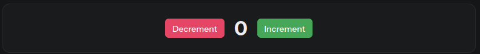

# Uvod

[Sadržaj](00_sadrzaj.md)

Refleks je otvoren okvir za brzo izradu prelepih, interaktivnih veb aplikacija u čistom Pajtonu.

## Ciljevi

- Čisti Pajton  
  Koristite Pajton za sve. Ne brinete o učenju novog jezika.

- Lak za učenje  
  Izgradite i delite svoju prvu aplikaciju za nekoliko minuta. Nije potrebno iskustvo razvoja veb-a.

- Potpuna fleksibilnost  
  Ostaje fleksibilan kao kod tradicionalnih veb okvira. Refleks je jednostavan za upotrebu, ali omogućava i napredne slučajeve upotrebe.  
  Izgradite bilo šta od malih aplikacija za nauku o podacima do velike veb lokacije sa više stranica. Cela ova veb lokacija je sagrađena sa refleksom!

- Baterije su uključene  
  Nema potrebe da se posegnete za gomilom različitih alata. Refleks rukuje korisničkom interfejsom, logikom na strani servera i raspoređivanjem vaše aplikacije.

### Primer aplikacije - Brojanje

Evo, prelazimo na jednostavnu aplikaciju brojača koja omogućava korisniku da broji na gore ili dole.



Evo potpunog objašnjenja koda za ovaj primer:

`Frontend` je izgrađen deklarativno koristeći refleks komponente. Komponente se kompajliraju u JS-a i služe se korisnicima pregledača, dakle:

- Koristite samo `refleks komponente`, `vars` i `var operacije` prilikom
  izgradnje vašeg UI-a. Bilo koja druga logika treba da se stavi u vašu `State` klasu ( `backend` ).

- Koristite `rx.cond` i `rx.foreach` (zamenjuje `if` i `for` izjave), za
  stvaranje dinamičnih UI-ova.

`Backend` pišete u `State` klasi. Ovde možete definisati funkcije i promenljive koje se mogu referencirati u `frontend`-u. Ovaj kod radi direktno na serveru i nije kompajliran, tako da nema posebnih ograničenja. Ovde možete koristiti bilo koju pajton spoljnu biblioteku i pozvati bilo koju metodu/funkciju.

Svaka `strana` je Pajton funkcija koja vraća refleks komponentu. Možete da definišete više stranica i krećete se između njih, pogledajte odeljak za usmeravanje za više informacija.

Počnite sa jednom stranicom i skalirajte do 100 stranica.

```py
import reflex as rx

# backend
class State(rx.State):
    count: int = 0
    def increment(self):
        self.count += 1
    def decrement(self):
        self.count -= 1

# frontend
def index():
    return rx.hstack(
        rx.button(
            "Decrement",
            color_scheme="ruby",
            on_click=State.decrement,
        ),
        rx.heading(State.count, font_size="2em"),
        rx.button(
            "Increment",
            color_scheme="grass",
            on_click=State.increment,
        ),
        spacing="4",
    )

# Kreiranje aplikacije i dodavanje stranice
app = rx.App()
app.add_page(index)
```

## Struktura Refleks aplikacije

### Import

```py
import reflex as rx
```

Počinjemo uvozom refleks paketa (alijas `rx`). Referenciramo refleks stavke kao `rx.*` po konvenciji.

### Klasa State

```py
class State(rx.State):
    count: int = 0
```

"State" definiše sve promenljive (nazvane `vars`) u aplikaciji koje se mogu promeniti, kao i funkcije (nazvane `event handlers`) koje ih menjaju.

Ovde naša klasa "State" ima jednu var, "count", koja je trenutna vrednost brojača. Inicijaliziramo je na 0.

### Event Handlers

```py
def increment(self):
    self.count += 1

def decrement(self):
    self.count -= 1
```

U okviru "State" klase definišemo funkcije, nazvane `event hendlers`, koje menjaju stanje `vars`.

> [!Note]  
> Event hendlers su jedini način na koji možemo modifikovati stanje u Refleksu. Oni se mogu pozvati kao odgovor na korisničke akcije, poput klika na dugme ili kucanje u tekstualno polje. Ove akcije se nazivaju `eventi`.

Naš brojač ima dva event henlera, "increment" i "decrement".

### User Interface (UI)

```py
def index():
    return rx.hstack(
        rx.button(
            "Decrement",
            color_scheme="ruby",
            on_click=State.decrement,
        ),
        rx.heading(State.count, font_size="2em"),
        rx.button(
            "Increment",
            color_scheme="grass",
            on_click=State.increment,
        ),
        spacing="4",
    )
```

Ova funkcija definiše korisnički interfejs aplikacije.

Koristimo različite komponente kao što su `rx.hstack`, `rx.button` i `rx.heading` da bi izgradili frontend. Komponente se mogu gnezditi da bi  stvorili složene rasporede i mogu se stilizovati pomoću pune snage CSS-a.

Refleks dolazi sa 50+ ugrađenih komponenti koje će vam pomoći da započnete. Aktivno dodajemo više komponenti. Takođe, lako je omotati svoje `React` komponente u Refleks komponente.

```py
rx.heading(State.count, font_size="2em"),
```

Komponente mogu da referenciraju "state vars" aplikacije. Komponenta `rx.heding` prikazuje trenutnu vrednost brojača referencirajući "State.count". Sve komponente koje referenciraju `state vars` neke `state` klase reaktivno će se ažurirati kad god se stanje promeni.

```py
rx.button(
    "Decrement",
    color_scheme="ruby",
    on_click=State.decrement,
),
```

Komponente komuniciraju sa klasom `state` povezanim okidačima događaja - `event trigers` na `event handlers`. Na primer, `on_click` je događaj koji se aktivira kada korisnik klikne na komponentu.

Prvo dugme u našoj aplikaciji veže `on_click` event na "State.decrement" event hendler. Slično tome, `on_click` drugog dugmeta se povezuje na "State.increment" event hendler.

Drugim rečima, redosled ide ovako:

- Korisnik klikne na "increment" dugme na UI.
- `on_click` `event triger` dugmeta "increment" je okinut.
- `Event handler` "State.increment" je pozvan.
- Vrednost "State.count" je inkrementirana.
- UI ažurira UI da odrazi novu vrednost "State.count" promenljive stanja.

### Dodavanje strana

Zatim definišemo našu aplikaciju i dodajemo `counter` komponentu na osnovnu rutu.

```py
app = rx.App()
app.add_page(index)
```

## Sledeći koraci

Stvorili smo jednostavnu, ali potpuno interaktivnu veb aplikaciju u čistom Pajtonu.

Ako nastavite sa našom dokumentacijom, naučićete kako graditi sjajne aplikacije sa Refleksom.

[Sadržaj](00_sadrzaj.md)
